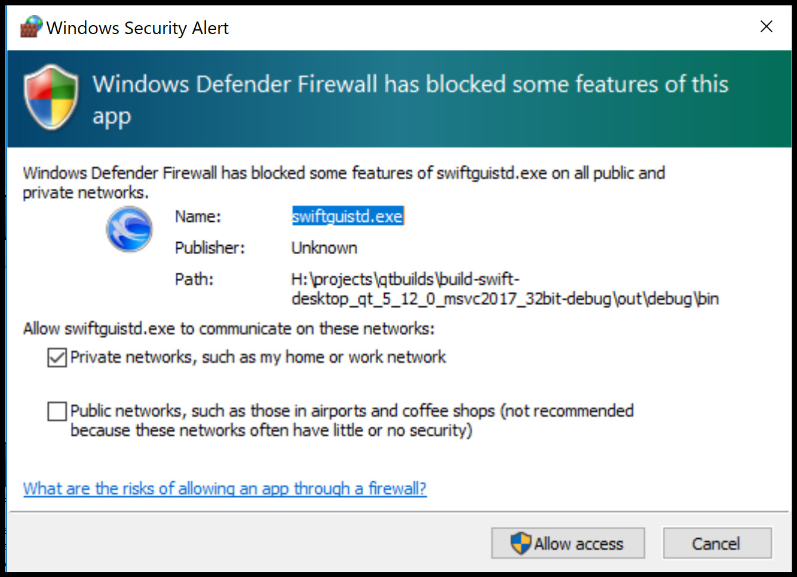
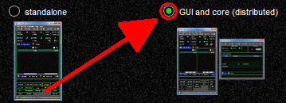
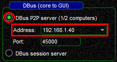
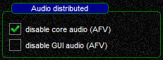
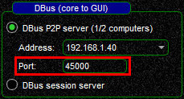

<!--
    SPDX-FileCopyrightText: Copyright (C) swift Project Community / Contributors
    SPDX-License-Identifier: GFDL-1.3-only
-->

!!! tip

    There is also a YouTube video about this, [see here](./../home/video_tutorials.md).

*swift* can be run in **Distributed Mode** where "distributed" means that the Core-function of *swift* (see [swiftCore](./swift_core.md)) is separated from swift*GUI (Graphical User Interface, the application front end) and can thus be used remotely via a network.
If you do this, the standard configuration is having *swift*Core run on the computer that is home to your flight simulator platform.
*swift*GUI will run on another (remote) computer.
In theory you could run *swift*Core and *swift*GUI on the same computer in distributed mode, but it wouldn't make much sense, so don't do it  unless you have a real good reason for it.

As you can see in *swift*Launcher, you have 2 options:

{: style="width:50%"}

* **Standalone:** this is the **standard mode** of operating *swift* where *swift*GUI and *swift*Core are combined within the same application, no other component of *swift* needs to be started. With this mode selected, *swift*Core is inhibited in *swift*Launcher
* **GUI and Core:** use this mode if you want to run *swift*GUI and *swift*Core as separate applications for remote operations, that's the **Distributed Mode**

## Running swift in Distributed Mode on 2 different computers

### Prerequisites
  * *swift*Core and *swift*GUI must be of the **same version**, do **not** mix different versions
  * both computers need a stable network connection and DBus connections between the two machines need to be possible (check settings of your firewall, virus scanners etc. - e.g. "Acronis Active Protection" seems to be quite aggressive)

  {: style="width:50%"}

### Setting up the connection
  - start *swift*Launcher **only** on the computer that will be running *swift*Core
  - change the setting from **''standalone''** to **''GUI and core (distributed)''**
    {: style="width:50%"}
  - in **''DBus (core to GUI)''** select **''DBus peer to peer server''** and in **''Address''** insert the **LAN IP** address of the computer that is running your flight simulator and *swift*Core
    {: style="width:50%"}
    * **Important:** you have to use the correct LAN IP address of your computer and **not** just 127.0.0.1! This address would not be reachable from another computer in your network. **If you do not know the LAN IP address of your computer**, e.g. in Windows start **Command Prompt** by opening your Windows Start Menu and type "command". A window will pop up. In there, type "ipconfig" and use the IPv4-address (in our example it is 192.168.1.40)
    * **do not use session server**: session server is limited to connections on the same computer, it will not work with remote computers
  - in **''Audio distributed''** set a check-mark for the application that should have its AFV (Audio For VATSIM) functions **disabled**, either *swift*Core or *swift*GUI
    {: style="width:50%"}
  - **start *swift*Core** on the computer that is home to your flight simulator
  - only now start *swift*Launcher on the remote computer where you want to run *swift*GUI
  - change the setting from **''standalone''** to **''GUI and core (distributed)''**
    {: style="width:50%"}
  - select **''DBus peer to peer server''** and insert the **LAN IP address** that you configured in step 3. *swift*GUI will now try to connect to *swift*Core at this IP
    {: style="width:50%"}
  - in **''Audio distributed''** set a check-mark for the application that should have its AFV (Audio For VATSIM) functions **disabled**, it has to be the **same choice as in step 4**!
    {: style="width:50%"}
  - **start *swift*GUI** on your remote computer

### What happens where?
  * **model matching** is done in ***swift*Core**, therefore your **CSL/AI model sets** must be installed **on the computer that is running swiftCore**
  * the GUI-part of *swift*GUI does **not** require a model set, it will use the one from *swift*Core on the remote computer
  * *swift*Core is responsible for communicating with online flying services like VATSIM and other FSD-servers. This computer has to have **access to the internet**, otherwise it cannot connect to them
  * *swift*Core connects to your flight simulator platform through SimConnect, //xswiftbus// or FSUIPC
  * *swift*Core and *swift*GUI exchange information with each other on the **port** set in your **DBus settings** (don't confuse this connection with the //xswiftbus// connection)
    {: style="width:50%"}
  * **AFV/Audio For VATSIM** can run either through *swift*Core **or** *swift*GUI and requires **UDP port 50000** to be enabled

### swiftCore and flight simulator on separate computers
As an alternative to running *swift*Core on the computer that houses your flight simulator, you can also setup a connection to a flight simulator via LAN (local area network).
In order to create a model set in such a scenario, you will need remote access (shared drive etc.) to your CSL/AI model directory.

### FSX/P3D
*swift* can use SimConnect in remote configuration: See [here](./flying/remote_simconnect.md).
This allows for connecting a remote FSX/P3D from a standalone *swift*GUI.

There are two ways to setup a distributed scenario

* **Distributed** *swift*GUI on computer 1, *swift*Core on computer 2 (with your flight simulator).
  *swift*Core will be using a local SimConnect connection.
* **Standalone** *swift*GUI on computer 1, connected via "remote SimConnect" to computer 2.
  **No separate *swift*Core will be needed**!

### FS9
You can use **WideFS** for a remote connection and run *swift*GUI in **standalone mode**.
Make sure that DirectPlay is also setup for remote access.

## Command Line Arguments
If you regularly use *swift* in **Distributed Mode**, you can save yourself from making all necessary settings in *swift*Launcher manually.
All apps of *swift* can be started with **[command line arguments](./../troubleshooting/command_line_arguments.md)** and you only need to **setup program shortcuts** to launch *swift*Core and *swift*GUI with your pre-defined settings.

After setting up *swift*Launcher you can access and copy the Command Line Arguments for *swift*Core and *swift*GUI by holding down your SHIFT-key and clicking on the respective program icon inside *swift*Launcher.

Otherwise use these instructions on how these Command Line Arguments are composed:

### swiftCore arguments
  * ``--dbus tcp:host=your IP,port=your Port`` (your IP, e.g. 192.168.1.40, Port 45000)
  * ``--minimized`` (*swift*Core will be minimized after start)
  * ``--noaudio`` (disable AFV in *swift*Core. Use it **only** if you want to use AFV with *swift*GUI on the other computer)
=> ``swiftcore.exe --dbus tcp:host=192.168.1.40,port=45000 --minimized --noaudio``

### swiftGUI arguments
  * ``--dbus tcp:host=your IP,port=your Port`` (your IP, e.g. 192.168.1.40, Port 45000)
  * ``--core d`` (Core mode: **D**istributed)
  * ``--noaudio`` (disable AFV in *swift*GUI. Use it **only** if you want to use AFV with *swift*Core on the other computer)
=> ``swiftguistd.exe --dbus tcp:host=192.168.1.40,port=45000 --core distributed`` (in this example ``--noaudio`` is not part of the arguments, because we want to use *swift*GUI's AFV).
