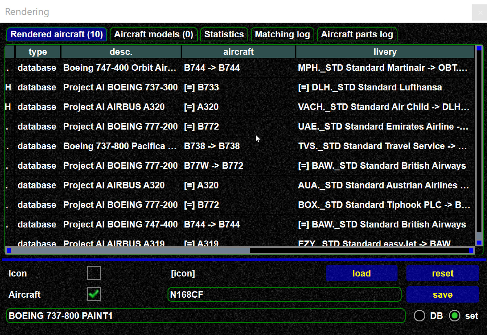
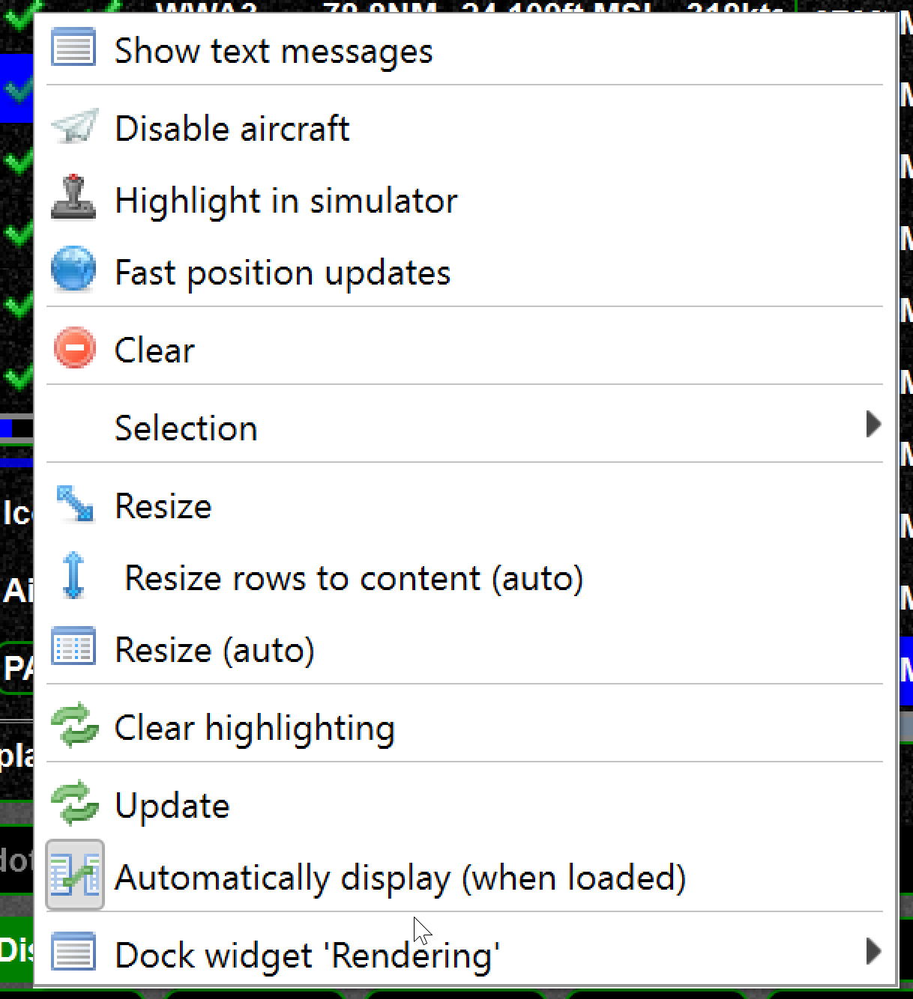
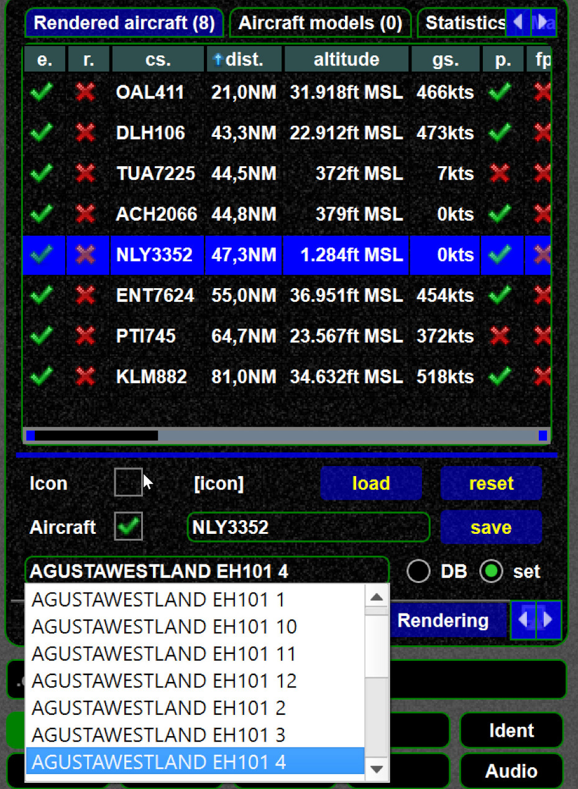

<!--
    SPDX-FileCopyrightText: Copyright (C) swift Project Community / Contributors
    SPDX-License-Identifier: GFDL-1.3-only
-->

There are two aircraft views:

* "aircraft in range":
This is a network (e.g. VATSIM, ..) focused view.
It shows aircraft in the airspace, their distance and pilot
* "models":
This view focus on the aircraft models in the simulator, the rendering (if displayed in simulator), the model matching

## swift pilot client "aircraft in range"

Shows network aircraft, airports in range.

## swift pilot client model view

The rendering view contains a lot of information.
Therefore the screenshot is split into a left and a right part.

-   `e/r` shows if the aircraft is enabled (you can disable an aircraft)
    and if the aircraft is rendered (shown) in the simulator. If an
    aircraft is not rendered this either means a problem with model in
    the simulator, or the adding-to-simulator operation is still
    pending.
-   `p` means aircraft parts are supported to transfer light, flap,
    spoiler data.
-   `fp` means fast position updates are enabled

-   `aircraft` shows how the model is matched, an `=` sign means an
    exact match, otherwise it is shown what is used instead e.g.
    `B737->B735`
-   `livery` shows how the livery is matched

{: style="width:50%"}

### Manually change model

You can manually assign a model for a given aircraft.
See [this article](./../swift_gui/models/manually_changing_models.md).

{: style="width:50%"}

