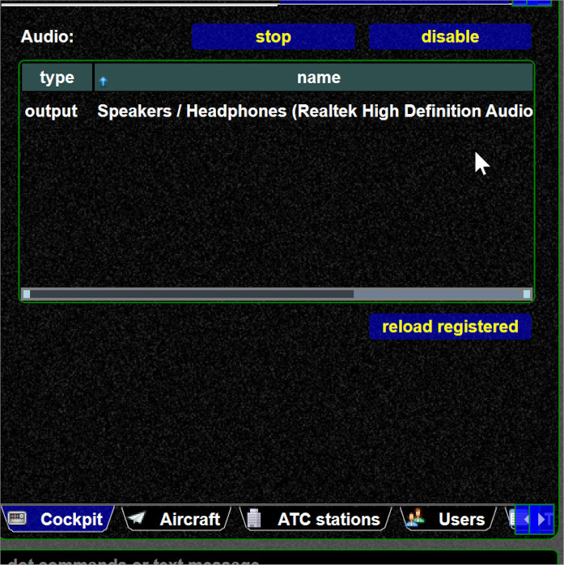
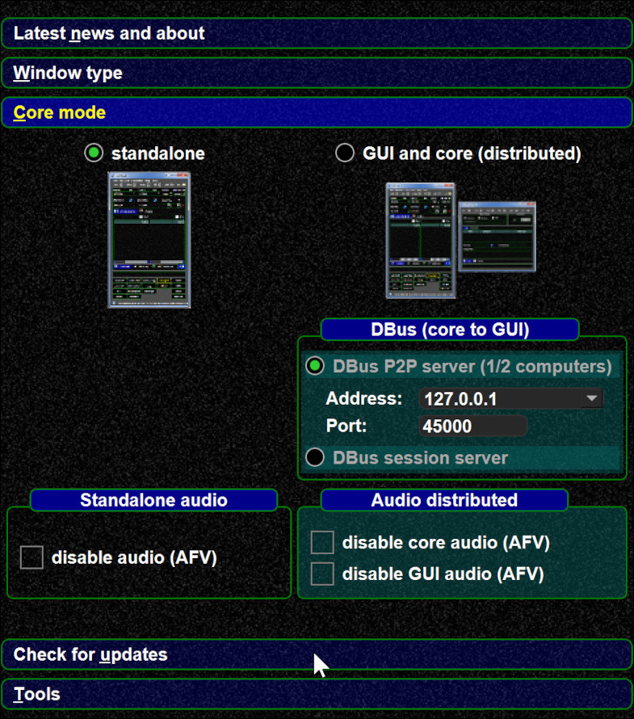

<!--
    SPDX-FileCopyrightText: Copyright (C) swift Project Community / Contributors
    SPDX-License-Identifier: GFDL-1.3-only
-->

swift has build-in AFV support.
If you want to disable it (e.g. because you want to use the external AFV client) you can do.

-   From the client:

{: style="width:50%"}

-   From swift launcher:

{: style="width:50%"}

-   as command line argument ``--noaudio``
