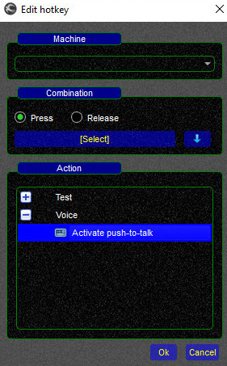

<!--
    SPDX-FileCopyrightText: Copyright (C) swift Project Community / Contributors
    SPDX-License-Identifier: GFDL-1.3-only
-->

{: style="width:30%"}

* Hotkeys as the push to talk (PTT) button can be defined under `Settings` => `Hotkeys`
* Hotkeys can be **keyboard keys** or **joystick buttons**
* Hotkeys are machine dependent, when you use a distributed version of *swift* the hotkey can originate from your local machine or the remote machine

## Troubleshooting and testing

* if a combination is not working **delete it and add it again**.
  It can be that the identifier of the key has changed and the code hence is not recognized.
* if you want to test a particular key combination, you can assign the `Test` => `Message`.
  You will see a small popup when you press the key combination (indicating the combination works).
