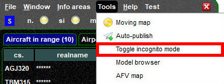
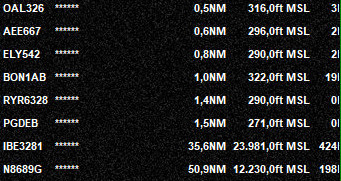

<!--
    SPDX-FileCopyrightText: Copyright (C) swift Project Community / Contributors
    SPDX-License-Identifier: GFDL-1.3-only
-->

With the **Incognito Mode** you have the option to hide the names of other members in *swift*GUI.
This may be interesting for when you stream your flights.

In *swift*GUI access the ``Tools`` menu and select ``Toggle incognito mode``

The names of all controllers, pilots and observers will be replaced by stars to mask them

