<!--
    SPDX-FileCopyrightText: Copyright (C) swift Project Community / Contributors
    SPDX-License-Identifier: GFDL-1.3-only
-->

Having your own flyable aircraft mapped in our database is a **convenience** item.

The difference between having your own aircraft in our database or not is:

| | |
|-|-|
|**AIRCRAFT MAPPED** **green frame** around `Model` box 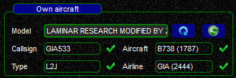 | in *swift*GUI's **Connect** dialogue **all aircraft data will be pre-filled correctly**, you just choose and complete your callsign. Saves time and prevents mistakes |
|**AIRCRAFT NOT MAPPED** **yellow frame** around `Model` box 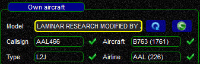 | in the **Connect** dialogue you will have to **verify and correct all data-fields** (ICAO aircraft type, type of aircraft, airline livery code), because *swift* does not know all details of your aircraft. Takes more time and mistakes are more likely |

## Quick Mapping Wizard
The frame of the field ``Model`` (= your own aircraft) being drawn in yellow indicates that *swift*GUI was able to read the aircraft model from your simulator,but that it could not find it in your cached database:

Although you could also update *swift* Datastore with our Mapping Tool (*swift*Data), a quicker and easier way will be using *swift*GUI's **Quick Mapping  izard**!

!!! tip

    Adding the aircraft model to the Datastore will make using swift more comfortable not only for you, but **all other users will profit from this**, as the data will shared through our database.

Let's assume we just installed the livery of "Garuda Indonesia" for our "Zibo Mod Boeing 737-800X" in X-Plane 11.
After loading the aircraft with its new livery, we start *swift*GUI.
Its ``Connect`` dialogue does not fully recognize this combination of aircraft and airline and shows us this fact with the dreaded yellow frame:

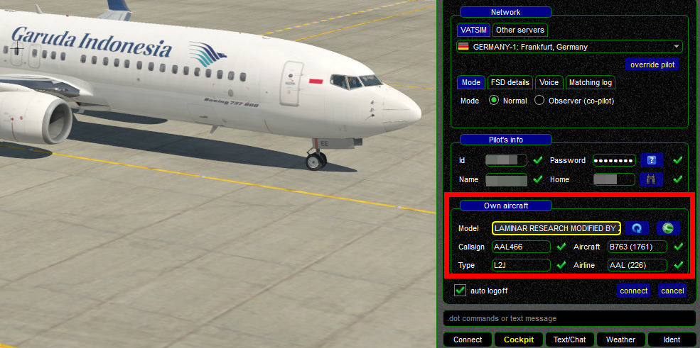

Clearly, this is neither a Boeing 767-300 (B763), nor the livery of American Airlines (AAL).
We need to correct these entries and also map them to have them correct the next time we want to use this aircraft and livery.

Let's add the aircraft to the database!
> The following steps are always the same, no matter what flight simulator platform and aircraft you use.

  * click on the **green swift button**  to launch the Quick Mapping Wizard
  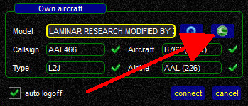
  * you should now see the start page of the Quick Mapping Wizard:
  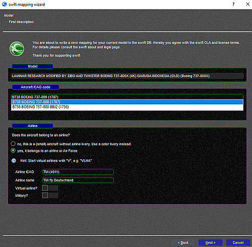
  * the data field ``Model`` shows you the information of the aircraft file in your flight simulator
  
  * ``Aircraft ICAO code``: fill in the ICAO code of the type of aircraft that you are mapping, in our case ``B738``, choose the correct sub-type from the list!
  If you are not sure about the correct code, you will be able to search it on the next page of the Wizard
  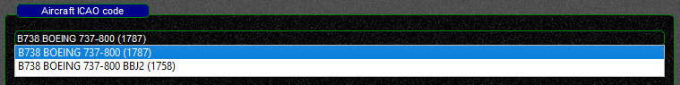
  * ``Airline``: here we have to fill in the correct ICAO code for the airline.
  If you do not know it, enter part of the name of the airline in the field ``Airline name`` and *swift* will show you all results.
  When choosing one, the field ``Airline ICAO`` will be completed automatically.
  If you are adding a general aviation aircraft that does not belong to an airline, choose the appropriate option and define an approximate livery (color for fuselage and tail)
  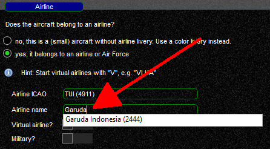 
  * **Aircraft Finder**: the next page of the Quick Mapping Wizard will allow you to search for aircraft types and type codes in more detail.
  If you are sure that the data provided on the first page was correct, proceed to the next page of the Wizard
  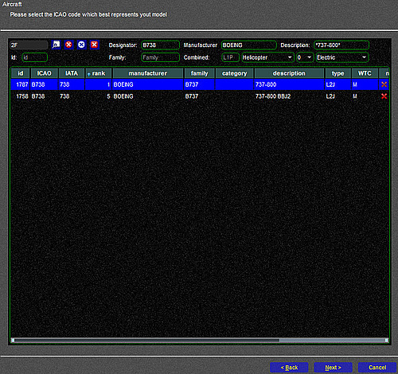
  * **Livery Finder**: the next page of the Quick Mapping Wizard will allow you to search for airlines and liveries in more detail.
  If you are sure that the data provided on the first page was correct, proceed to the next page of the Wizard
  
  * **Distributor Finder**: this is a rather important item!
  In *swift*-speak, a "distributor" is a person or an entity(organization) that has produced aircraft and/or liveries.
  **If you do not know** the distributor of your plane/livery/variant, or **if you are not sure**, **choose ''ZZZZ''**.
  Our database administrators will try to sort it out afterwards - this is better than submitting incorrect data!
  In our example the best choice would be to designate the livery as "Zibo", since we are using it with this aircraft model.
  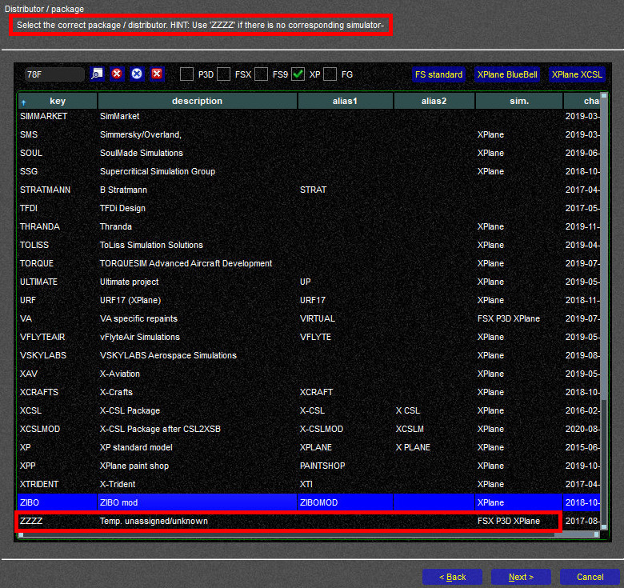
  * **Confirm Data**: on the next page you have another chance to verify that all data is a) valid and b) correct.
    * **Valid data** is data that is known to *swift*'s database and it is marked with vertical green bars (red circles on the screenshots).
      Only if **all fields** contain "valid data", a change request can be sent!
    * **Correct data** is what you consider as correct for the aircraft that you want to add to our database (red arrows)
      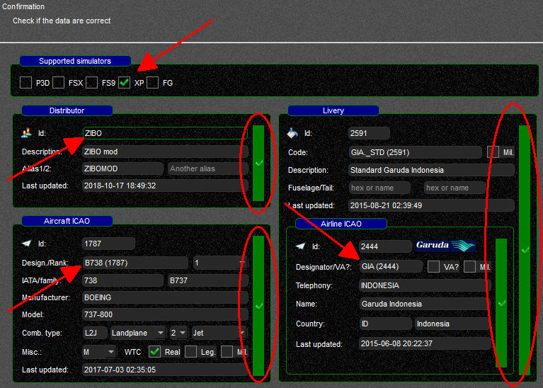
  * after one more confirmation page you will be presented with the login-dialogue for *swift* Datastore.
    This requires a **separate account**.
    **[See here for more information on how to create an account.](./../../documentation/swift_datastore/login.md)**
    After you have successfully logged in there, you should be able to log in through the Quick Mapping Wizard as well.
  * when you are logged in, confirm that you want to send your Change Request and a status-update will follow:

    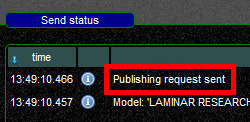

!!! note

    There will be **no immediate** results, because your Change Request will be queued in *swift* Datastore and then a database administrator has to verify your request and then either accept it, correct it or reject it.
    Only then will the mapped aircraft be recognized by *swift*GUI when you want to use it for a flight.
