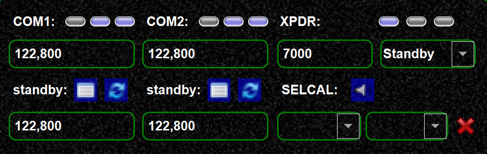
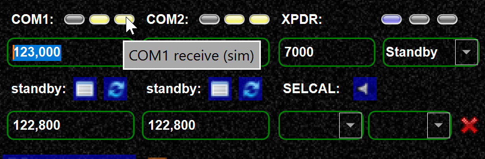
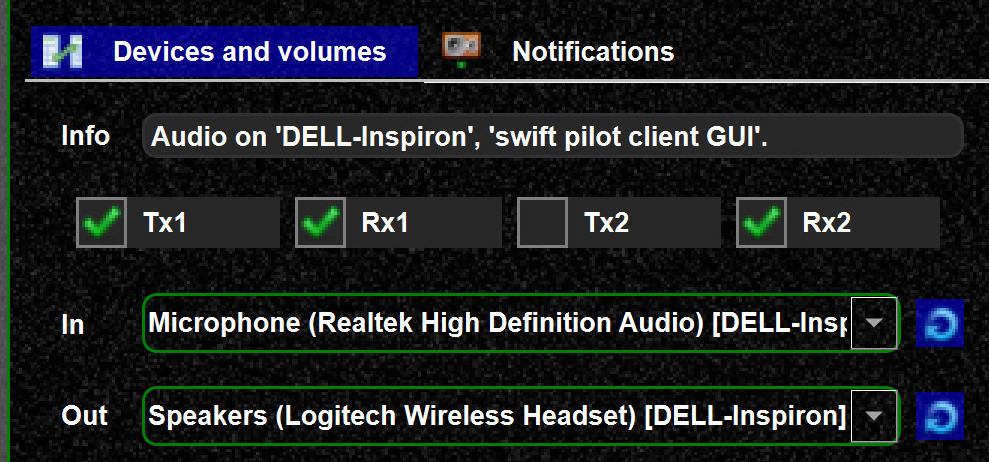

<!--
    SPDX-FileCopyrightText: Copyright (C) swift Project Community / Contributors
    SPDX-License-Identifier: GFDL-1.3-only
-->

-   You can enable COM unit synchronization (between simulator and
    *swift*) from the simulator settings

{: style="width:50%"}

-   Synchronization means

    > -   volume sync with simulator (not yet implemented)
    > -   enable/disable COM unit from simulator cockpit
    > -   transmitting/receiving as set in simulator COM unit (cockpit)

!!! warning

    If you use "synced" and you see NO (or incorrect) TX/RX values checked, it could mean your COM unit is off in the plane.
    Especially in XPlane the vendors follow various concepts indicating the COM status in the datarefs.
    If you cannot get it working with your plane, you could used the "un-synced" default values.

-   Integration off, all LEDs are blue

{: style="width:50%"}

-   Integration on, TX/RX as set in simulator cockpit

{: style="width:50%"}

-   use the tooltips for further information on the LEDs
-   with NO integration you will see always the default Rx/Tx values as
    here

{: style="width:50%"}

-   with sync that should change according to your aircraft cockpit

!!! note

    You might see no change of the LEDs before you change a COM frequency

## Summary

1.  if you "sync" with your cockpit, you can use `TX1` or `TX2` as set in your COM unit
2.  However, especially with **XPlane** vendors use all kinds of different concepts for the `datarefs`, so it can happen this does not work properly with some planes, you have to try.
3.  without sync. you can manually change `TX1/RX1/TX1/RX2` , this is for scenarios where cockpit sync does not work for you
4.  Currently we do not permit transmitting at 2 channels at once, this is precautionary.
So with a) you can select TX1 or TX2 (if the `datarefs` are correct)
