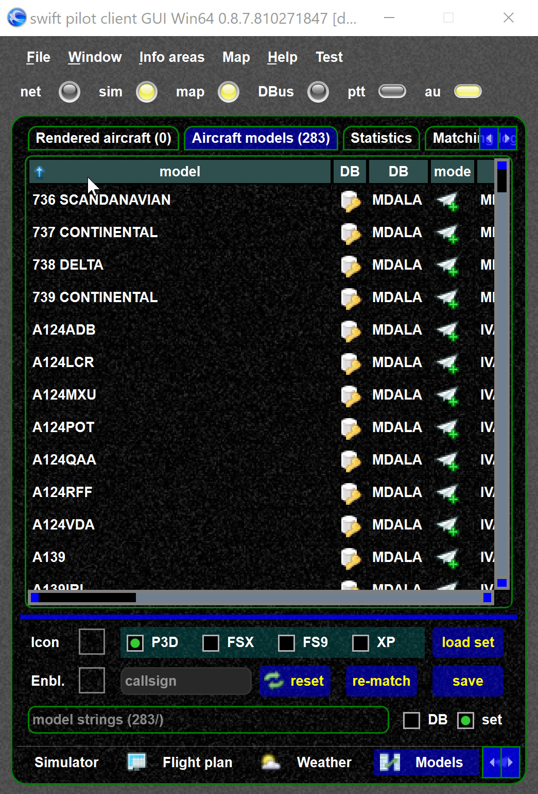

<!--
    SPDX-FileCopyrightText: Copyright (C) swift Project Community / Contributors
    SPDX-License-Identifier: GFDL-1.3-only
-->

!!! danger

    If you do not see any models here (press load set) then *swift* will not work for you.
    Something is wrong

If you wish to see your model set in the client, you can go to `Models` and `load set`.

{: style="width:50%"}
