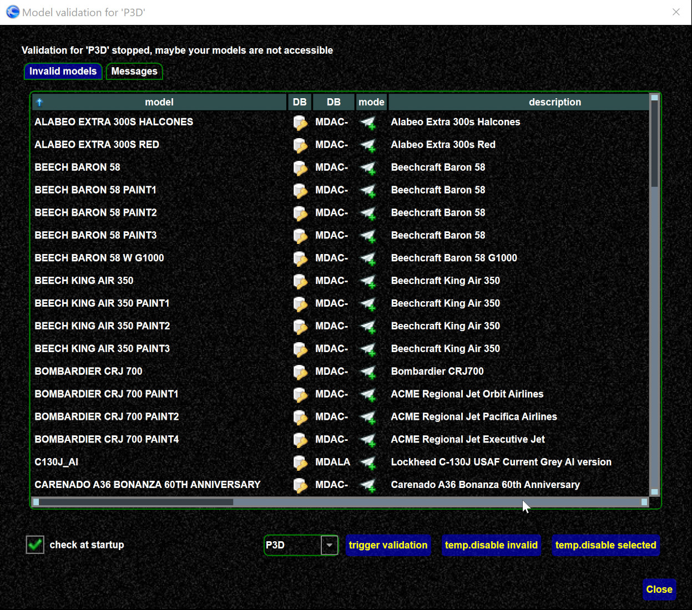

<!--
    SPDX-FileCopyrightText: Copyright (C) swift Project Community / Contributors
    SPDX-License-Identifier: GFDL-1.3-only
-->

*swift* assumes that the **models in your set are properly installed and working for your simulator**.
If not, it can happen that *swift* uses a model (as result of the matching procedure) which then fails to render.

!!! warning

    The normal situation should be that there are no validation errors.
    Fix your model set if models are removed or changed.
    So it is your responsibility to keep your model set up to date.
    However there are some tools helping you.

It can happen that models fail even though there is no validation error.

## Reasons for validation errors

* have you moved your model directories?
* have you deleted models?
* have you run updates that might have changed the models?

All that requires updating the own models and the model set.
Check the model file path of the models in your model set, then you can see where *swift* expects the models.
If you want to fix the path, you can re-create the model set, see [this article](./../../troubleshooting/models/create_recreate_model_set.md).

## How to enable validation?

From the settings (use SHIFT + settings button to get to the first page), click matching, scroll down a bit

{: style="width:50%"}

## Pilot client validations

In the matching settings you can setup how *swift* handles validation.

{: style="width:50%"}

1.  Verify set at startup: Checks your model set after *swift* was started.
    1.  this requires *swift* can access the model files (disk access to the model files)
    2.  this takes a while before completed (and runs in background)
    3.  models failing will be temporarily disabled
    4.  *swift* gives up if there are too many files failing, because it then assumes there is a general issue
2.  temporarily remove models failing.
    This means if a model fails during the matching process it will not be used anymore this session and the model will be disabled
3.  in order to avoid seeing a disabled model you can select the "use other model option".
    *swift* then tries to use another model before it fails, but gives up after some time

This is how the result dialog looks like.
There you can temp. disable such models.

{: style="width:75%"}

After you have disabled models, you will see them "in red" in the model view (might be you have to press "load set" to refresh the view).

{: style="width:50%"}

Btw, you can also temp. disable a model from the context menu.

{: style="width:50%"}

## Trigger validation in pilot client

From the model page in the client, click the ``validate`` button,

{: style="width:50%"}

In the validation popup you either see messages already (if there are results already), or press ``trigger validation`` to start the validation (which takes a while before there are results)

## Validation in mapping tool

!!! warning

    This does a live check (unlike the background check of the pilot client above).
    In case the files are not accessible on a remote drive it can cause the mapping tool to hang before a timeout is reported.

In the mapping tool just select the models to be checked and run the validation.

{: style="width:50%"}
{: style="width:50%"}

If there was a previous validation in the *swift* pilot client yielding some invalid models, those can be also highlighted in the mapping tool.

{: style="width:50%"}

## A real world example

see [this article](./model_set_validation_example.md).

