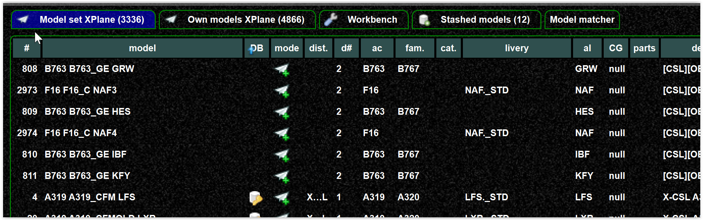

<!--
    SPDX-FileCopyrightText: Copyright (C) swift Project Community / Contributors
    SPDX-License-Identifier: GFDL-1.3-only
-->

In the client a validation error is shown, here one model is shown as invalid.

{: style="width:75%"}

It is also a good idea to check the messages/warnings

{: style="width:75%"}

## Resolve issues

Let's check the messages first, we deal with the invalid model later.
But there is also a warning about missing DB data.
This means you have used models in your set without DB metadata.
This is possible but not recommended.

As you can see there are entries without DB data, as you can see by the missing DB icon.

{: style="width:75%"}

There are three options now:

* someone creates mapping for those
* you remove them from the model set
* you ignore the warnings, which can lead to undesired matching results

Now we deal with the model

As a first step I do disable the invalid model (validation dialog)

{: style="width:75%"}

Then I can highlight the invalid model in the mapping tool

{: style="width:75%"}

Or you can exclude those models from the model set via the context menu

{: style="width:75%"}
