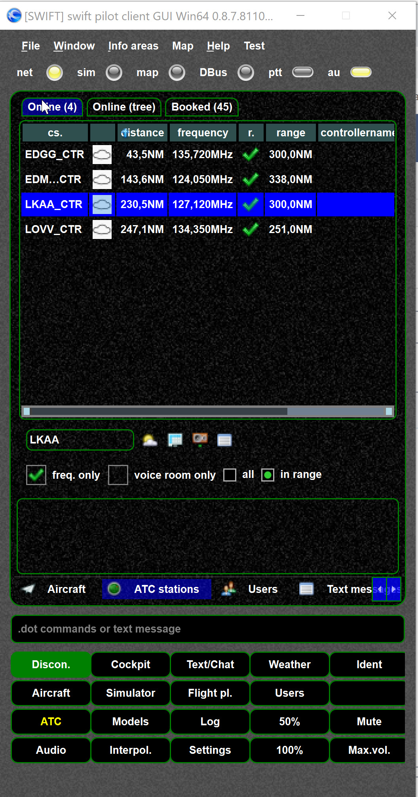
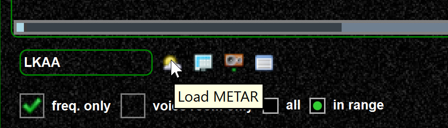

<!--
    SPDX-FileCopyrightText: Copyright (C) swift Project Community / Contributors
    SPDX-License-Identifier: GFDL-1.3-only
-->

## Voice ATIS

Voice ATIS (if available) behaves like any other ATC station

## Text ATIS/METAR

You can request METAR and ATIS from the ATC stations tab.

{: style="width:50%"}
{: style="width:50%"}

Consider the tooltips if you do not know what a button means.
*swift* provides useful tooltips in many cases.
