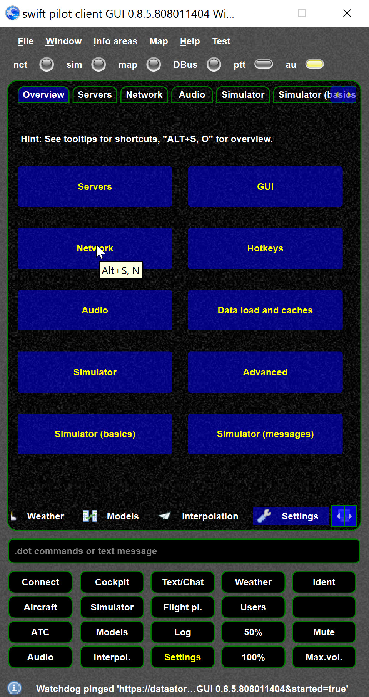

<!--
    SPDX-FileCopyrightText: Copyright (C) swift Project Community / Contributors
    SPDX-License-Identifier: GFDL-1.3-only
-->

# Pilot client settings

{: style="width:50%"}

You can get to the settings page via the ``Settings`` button.
Two important hints:

-   the pages have shortcuts, check them out by reading the tooltip
-   pressing SHIFT {key SHIFT} + settings will always get you to the overview page
