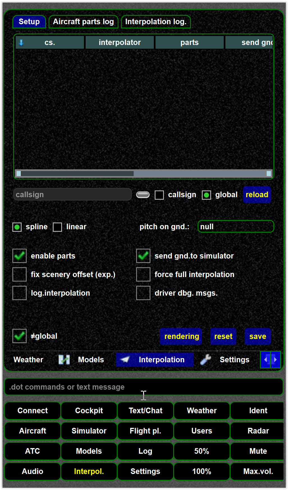

<!--
    SPDX-FileCopyrightText: Copyright (C) swift Project Community / Contributors
    SPDX-License-Identifier: GFDL-1.3-only
-->

In the interpolation settings the interpolation behaviour for all (global) or specific aircraft (callsign) can be changed.

* select if you want to change the global or specific settings

{: style="width:50%"}

* change the settings as required
* SAVE the settings

{: style="width:50%"}
