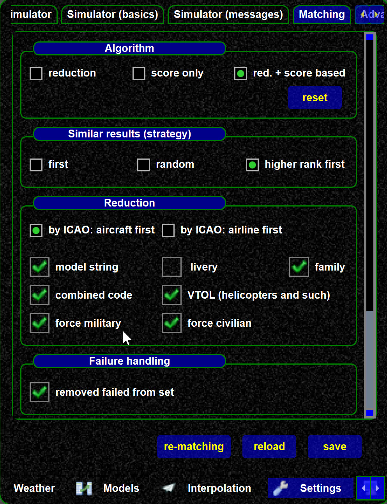
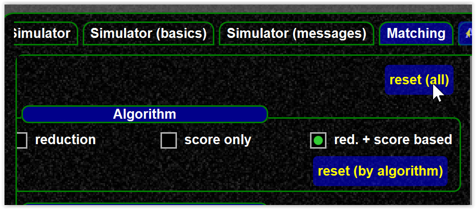
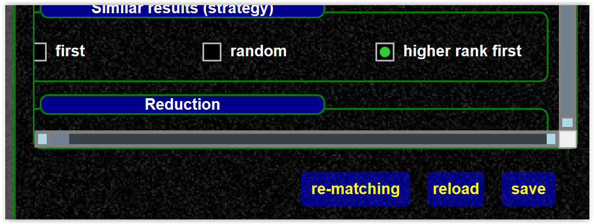
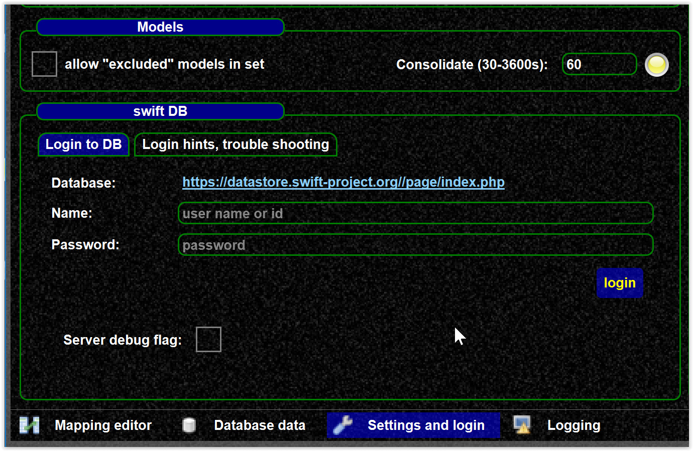
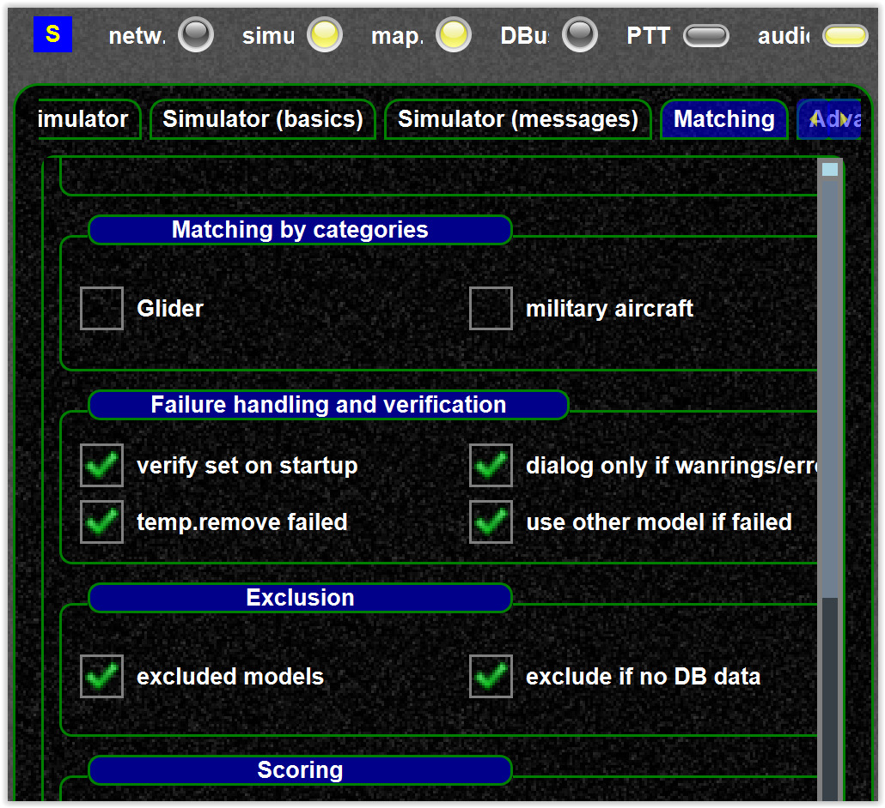

<!--
    SPDX-FileCopyrightText: Copyright (C) swift Project Community / Contributors
    SPDX-License-Identifier: GFDL-1.3-only
-->

In the matching settings you can configure how matching works/your preferences.
If you want to test your settings you can use the model matcher, see [mapping tool](./../../../troubleshooting/models/testing_model_set.md).

{: style="width:50%"}

## Reset matching script

Reset your settings (`reset all`) and **save your settings**.

{: style="width:50%"}

{: style="width:50%"}

## Matching script

Matching script allows to apply your own matching logic, see [this article](./../../../troubleshooting/model_matching/matching_script.md).

## Using models without DB entry

Using models without DB entries (i.e. without mappings) is not the recommend way.
You can create mapping like described [here](./../../swift_data/create_mapping.md).

However, if you want to use models without mappings:

-   allow those to be used in the model set, so enable it in the mapping tool.
    This allows those models to be added in the model set

{: style="width:70%"}

-   add the models you want to use in the model set
-   and in the pilot client enable those models to be considered in the
    matching

{: style="width:50%"}
