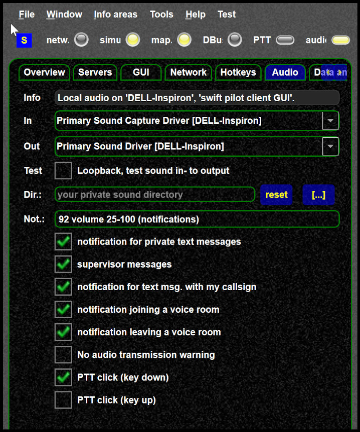

<!--
    SPDX-FileCopyrightText: Copyright (C) swift Project Community / Contributors
    SPDX-License-Identifier: GFDL-1.3-only
-->

You can enable notification sounds for various events.
To use your own sounds see [this article](./../../../troubleshooting/tweaking_notification_sounds.md).

{: style="width:50%"}

## Testing notification sounds

You can test the sounds by un-checking and checking the notification sounds.
This should play this sound.
