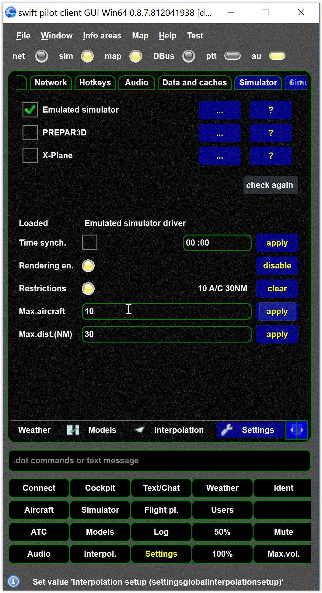
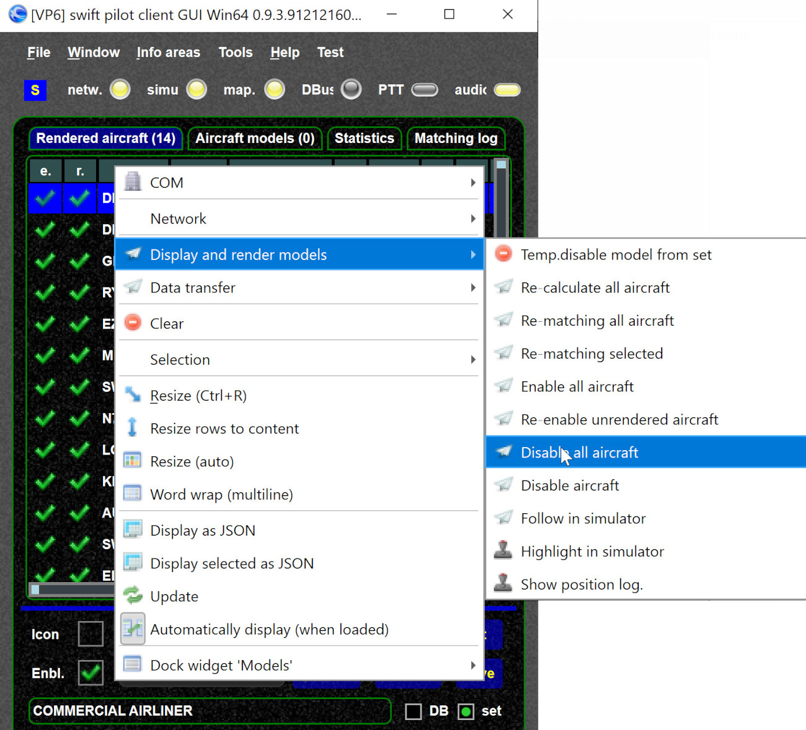

<!--
    SPDX-FileCopyrightText: Copyright (C) swift Project Community / Contributors
    SPDX-License-Identifier: GFDL-1.3-only
-->

You can restrict the number of aircraft and the maximum range of rendered aircraft.
We do not recommend to do so, unless you have particular reasons for that, as it can lead to surprising results (especially restricting number of aircraft).

`clear` removes the restrictions.

{: style="width:50%"}

## Disable all aircraft

If in some situations you need to disable all rendered aircraft you can do this from the context menu.

{: style="width:75%"}
