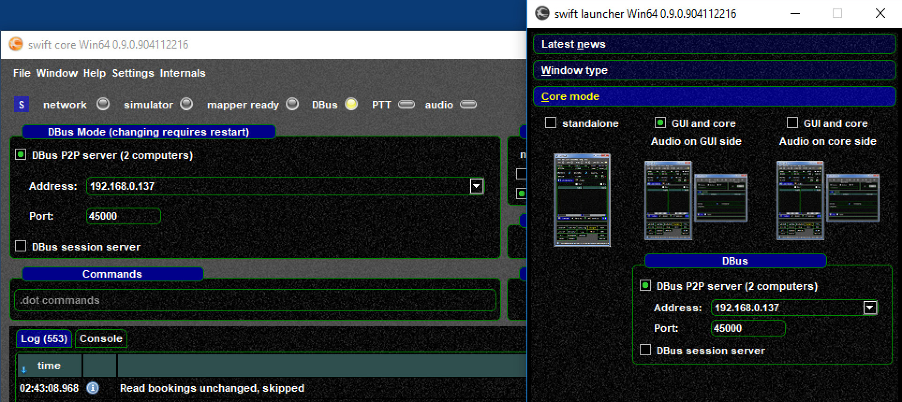
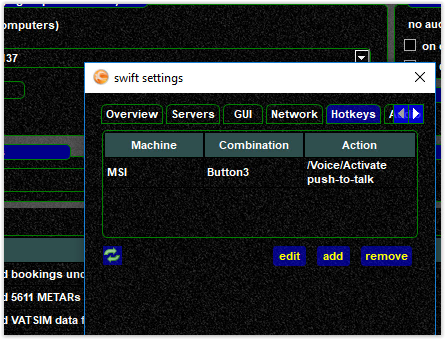
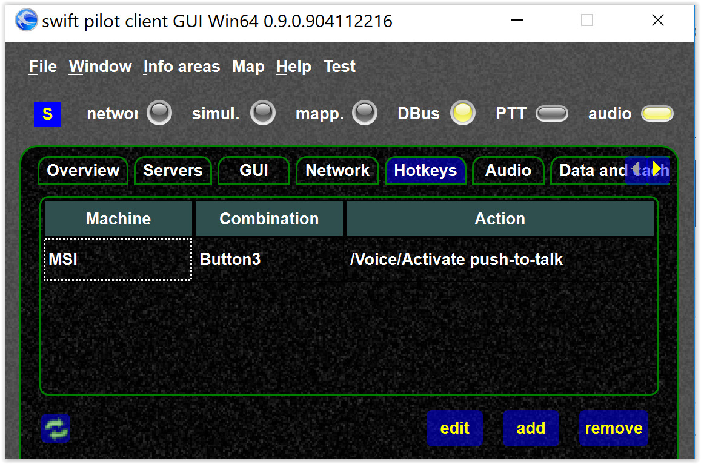
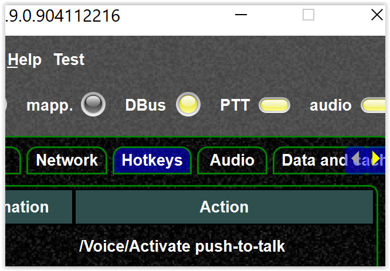

<!--
    SPDX-FileCopyrightText: Copyright (C) swift Project Community / Contributors
    SPDX-License-Identifier: GFDL-1.3-only
-->

Example:

-   `PCFlightSim MSI 192.x.x.137` with joystick, and *swift* core

    > -   *swift* core
    >
    > 
    >
    > -   here I define the PTT key, on the **PCFlightSim MSI**
    >
    > 

-   **LAPTOP** with remote *swift* GUI

    > -   on my laptop I see that PTT key, note the hotkey comes from **PCFlightSim MSI** but the screenshot is from **LAPTOP**.
    >     Make sure you **really run a GUI connected to the core** -\> DBus
    >
    > 
    >
    > -   now when I press the joystick button on **PCFlightSim MSI** (not on the laptop) I see the PTT LED ``on``, **on both machines** in the core and the GUI
    >
    > 
