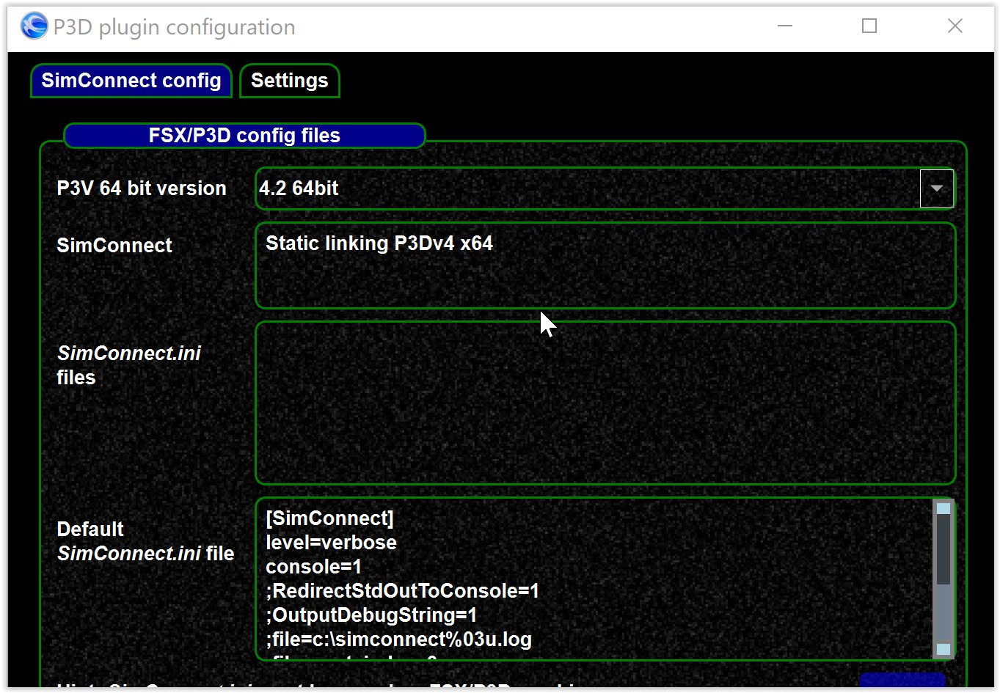
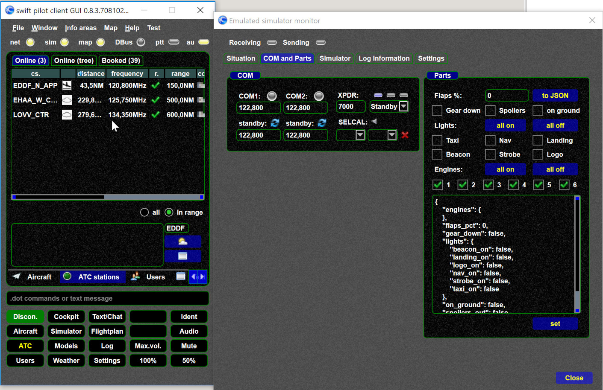

<!--
    SPDX-FileCopyrightText: Copyright (C) swift Project Community / Contributors
    SPDX-License-Identifier: GFDL-1.3-only
-->

## Supported driver

-   FS9 (experimental)
-   XPlane
-   FSX + P3D v1-3 legacy simConnect
-   P3D v4 64bit (new P3D simConnect linkage)
-   Emulated driver (for testing and observer tasks)

## Simulator version

You might need to select your simulator version like here

{: style="width:70%"}

Use Settings->Simulator->[...] to get there.

## Emulated driver

The emulated driver is for testing and special purposes only.
It allows to use swift without simulator in special cases.

## Settings of max. aircraft / max. distance

The simulator settings allow you to set

-   number of max. remote aircraft to be shown
-   max distance of remote aircraft to be shown
-   see [this article](./range.md)

{: style="width:50%"}
