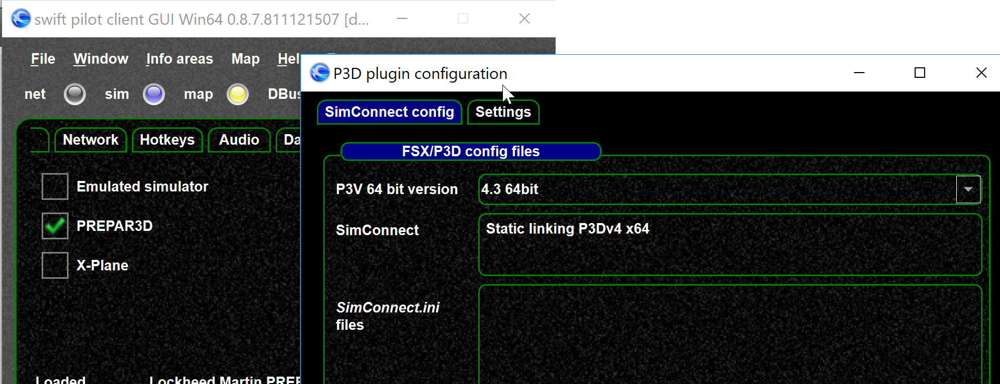

<!--
    SPDX-FileCopyrightText: Copyright (C) swift Project Community / Contributors
    SPDX-License-Identifier: GFDL-1.3-only
-->

!!! warning

    After changing the version restart *swift*

Since *swift* 0.8.7 it is possible to set the correct P3D version in the driver settings.

* Relevant for the 64bit version only, NOT the 32bit legacy FSX version
* We intend to support the latest 2-3 P3D versions
* After changing the version *swift* **requires a restart**
