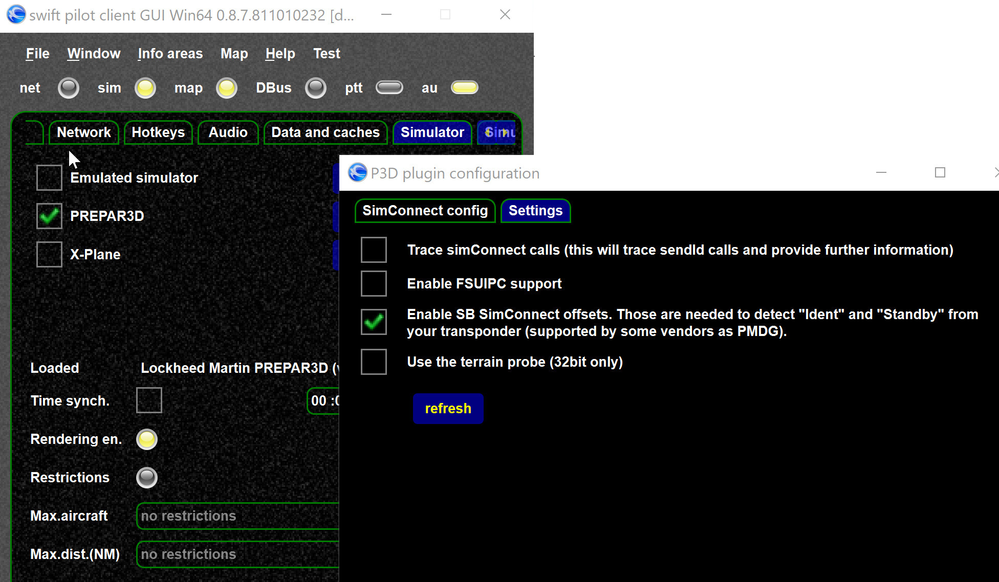
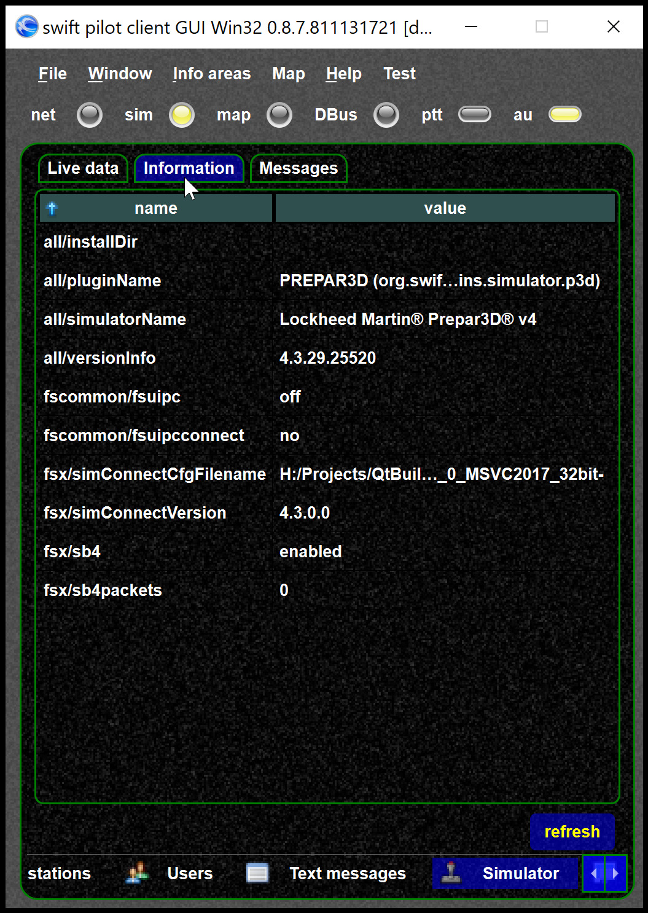
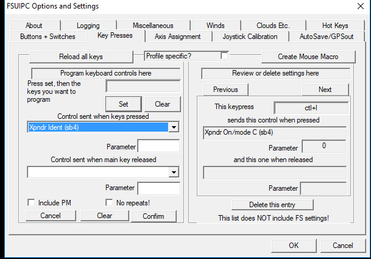

<!--
    SPDX-FileCopyrightText: Copyright (C) swift Project Community / Contributors
    SPDX-License-Identifier: GFDL-1.3-only
-->

In order to synchronize your transponder (XPDR) ident and mode values with *swift*, you need to enable the SB area (event though your client is *swift*).
Also the feature needs to be enabled by your aircraft, as PMDG or Leonardo do.

{: style="width:70%"}

If you want to see if you receive data from the SB4 offsets you can use.
You can see if the SB4 are is enabled and if data are received.
Once data are received `packets` is \> 0 and increasing.

{: style="width:70%"}

## Testing SB4 offsets

If you want to test the SB4 offsets you can send them via FSUIPC keys for testing.
Do NOT get that wrong, you do not FSUIPC for the SB4 XPDR area, but you can use FSUIPC if you want to test *swift* SB4 integration.

{: style="width:70%"}
