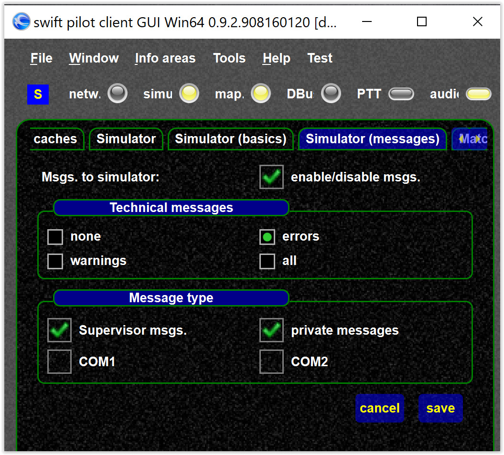

<!--
    SPDX-FileCopyrightText: Copyright (C) swift Project Community / Contributors
    SPDX-License-Identifier: GFDL-1.3-only
-->

Simulator settings control which messages are shown in the simulator window (in simulator).

* this requires the attached simulator has a simulator window
* the way how the messages are displayed may vary from simulator to simulator

{: style="width:70%"}
