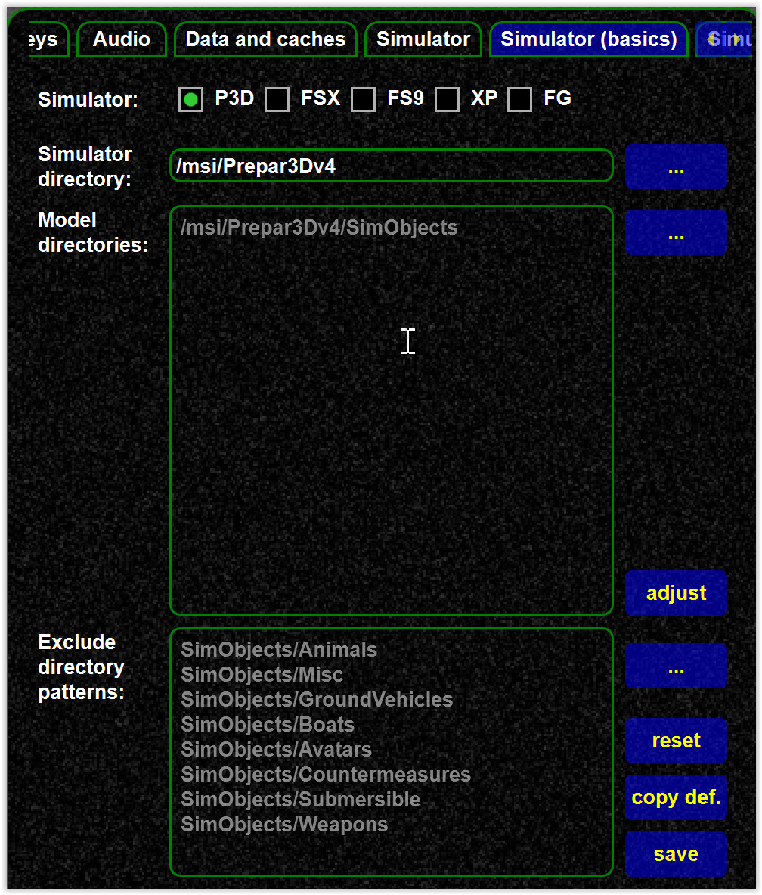
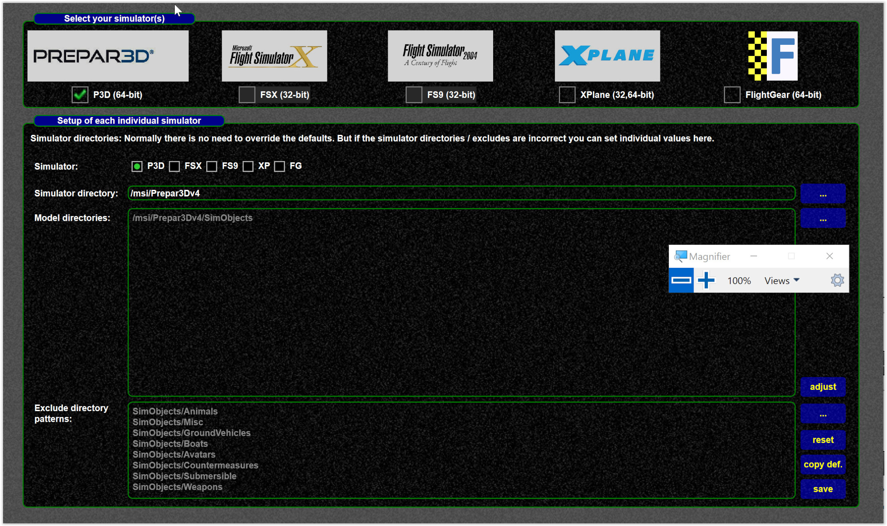

<!--
    SPDX-FileCopyrightText: Copyright (C) swift Project Community / Contributors
    SPDX-License-Identifier: GFDL-1.3-only
-->

The model directories can be configured under simulator settings here:

* you can change these settings in the pilot client, mapping tool and the launcher
* note the grayed out entries, in the settings, these are the values use if you DO NOT change (override) those, the default values are used
* changing the values here does NOT automatically update the model list and model set, the new values are affecting the paths in the model set when you re-create it.
* See [this article](./../../../troubleshooting/models/create_recreate_model_set.md).

{: style="width:50%"}

