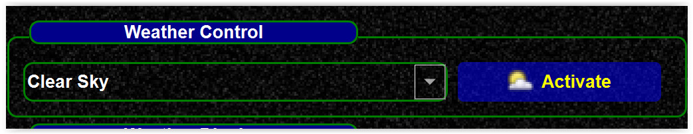
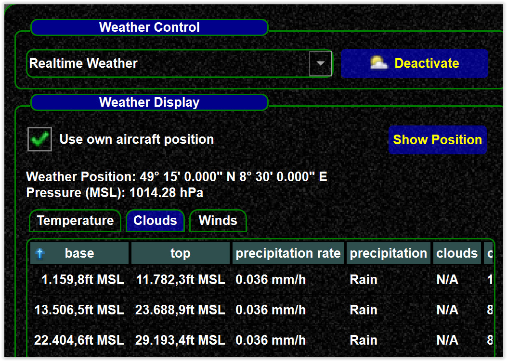

<!--
    SPDX-FileCopyrightText: Copyright (C) swift Project Community / Contributors
    SPDX-License-Identifier: GFDL-1.3-only
-->

!!! danger

    Deactivate *swift* weather if you want to use own weather engines

There is no explicit weather setting, but you can change weather simulation from the weather page directly

-   Weather is off, you can activate

{: style="width:75%"}

-   Weather is on, you can deactivate it

{: style="width:75%"}
