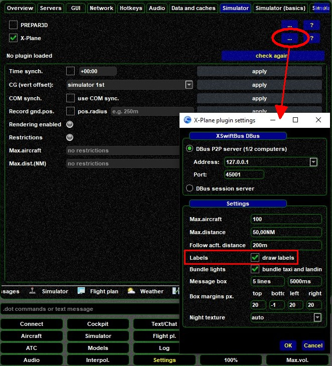

<!--
    SPDX-FileCopyrightText: Copyright (C) swift Project Community / Contributors
    SPDX-License-Identifier: GFDL-1.3-only
-->

## Temporary Toggle
Inside X-Plane open the Plugins menu, select xswiftbus and in there you'll find an option to toggle aircraft labels.

This setting is **not** permanent!
When you close X-Plane it will revert to its original setting.
To change this permanently follow the instructions of the next paragraph.

## Permanent Toggle
To **permanently save** label-settings you need to use *swift***GUI**.

Proceed to **``Settings``** and then select **``Simulator``**.
Clicking on **``[...]``** (at the right side of the X-Plane-line) will open the **X-Plane plugin settings** window.
**Check/uncheck (aircraft) ``Labels``**.
Changes to these settings will take effect immediately and are saved through a prompt when you close *swift*GUI.

{: style="width:70%"}
