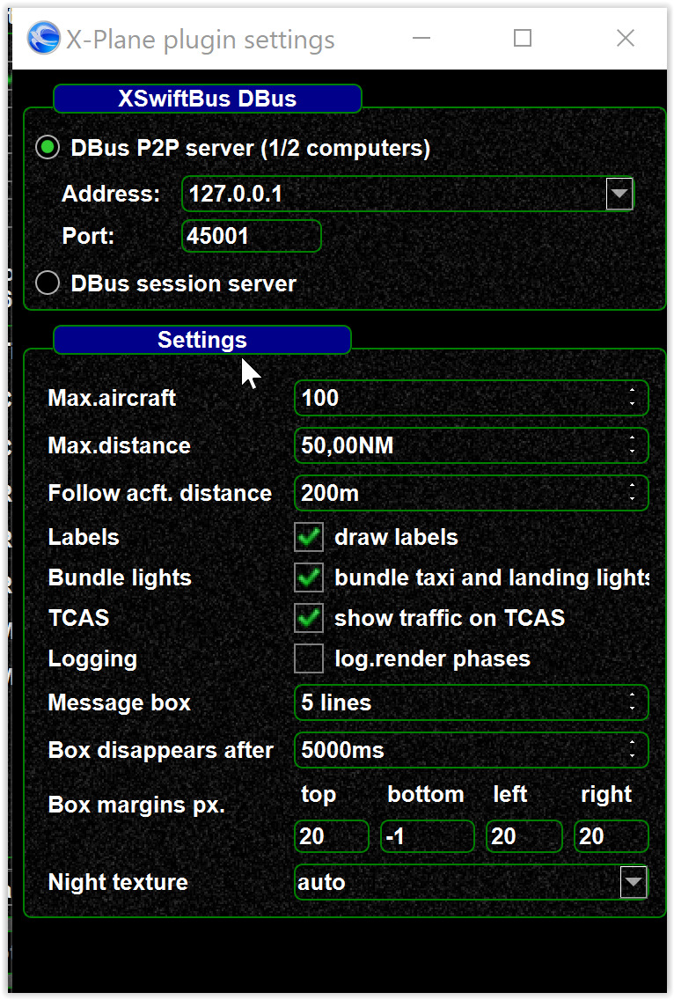

<!--
    SPDX-FileCopyrightText: Copyright (C) swift Project Community / Contributors
    SPDX-License-Identifier: GFDL-1.3-only
-->

see als [xswiftbus settings](./xswiftbus.md)

## Driver settings

The driver settings can be found here: Settings --> Simulator --> then click on the 3 dots right next to "X-Plane".

## TCAS settings

In order to display the other aircraft on TCAS *swift* uses some technical tricks.
Those can affect the stability and the performance of X-Plane.
Changing requires restarting X-Plane.

{: style="width:50%"}
