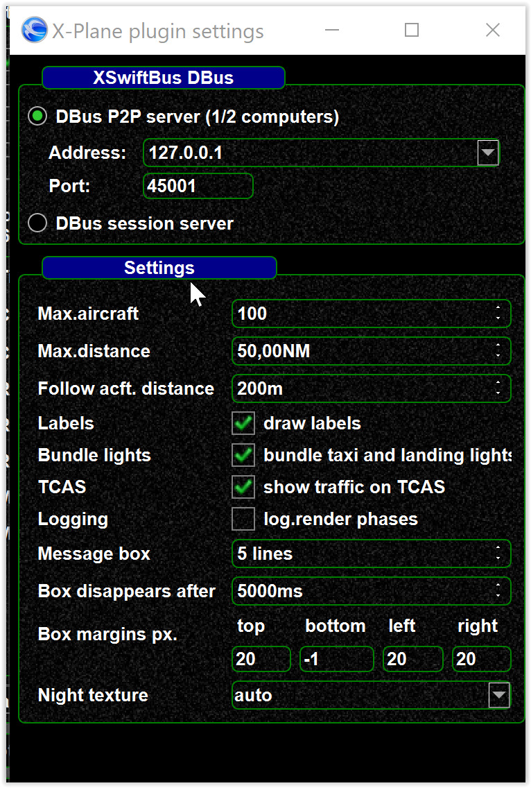

<!--
    SPDX-FileCopyrightText: Copyright (C) swift Project Community / Contributors
    SPDX-License-Identifier: GFDL-1.3-only
-->

see als [X-Plane driver settings](./xplane_driver.md)


When changing the connection details between *swift* and *XSwiftBus*,
the modification needs to be applied in sync on both sides. Otherwise
connection issues can occur.

## On the *swift* side

Open *swift* settings/Simulator and click 3 dots (...) opposite X-Plane
swift side:

{: style="width:50%"}

## On the XPlane plugin side

Modify `xswiftbus.conf` configuration file inside the `XSwiftBus` plugin folder.
It should look like this:

```conf
# DBus Mode - Options: p2p, session
dbusMode = p2p

# DBus server address - relevant for P2P mode only
dbusAddress = 127.0.0.1

# DBus server port - relevant for P2P mode only
dbusPort = 45001
```

Make sure to apply the same settings as on *swift* side.
**Any modification of this file will require a restart of XSwiftBus** (either by a restart of X-Plane or disabling/enabling *XSwiftBus* from the Plugin Manager).
