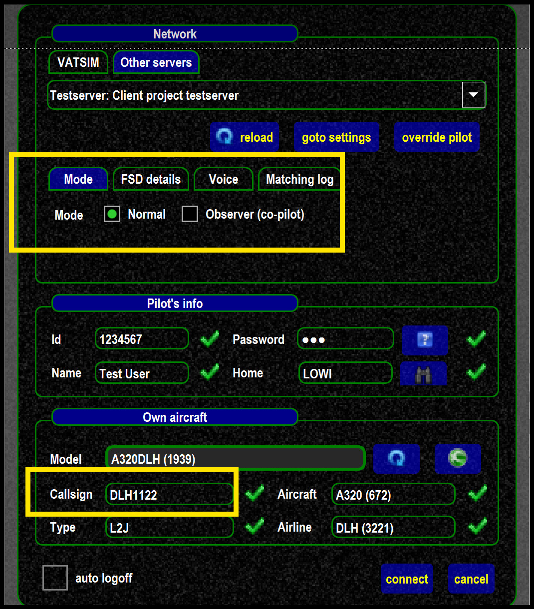
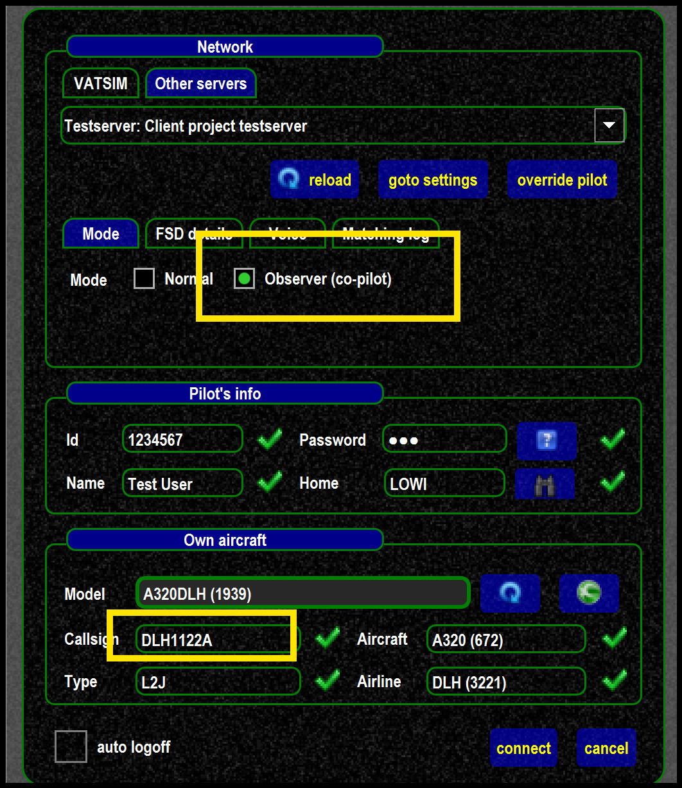
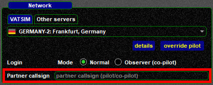

<!--
    SPDX-FileCopyrightText: Copyright (C) swift Project Community / Contributors
    SPDX-License-Identifier: GFDL-1.3-only
-->

*swift* can be used in a Shared Cockpit scenario, with one of the two pilots connected as co-pilot.

* the **PRIMARY pilot** has to connect just as usual in **''Normal mode''** and with the **planned callsign** for this flight.
This pilot will show up as normal to everyone else on the network

{: style="width:50%"}

* the **SECONDARY pilot** must
    * connect in **''Observer (co-pilot)''** mode. Doing so will prevent the secondary pilot to be shown online
    * **add an additional character to the callsign** used for this flight.
    This will stop the primary pilot's aircraft be shown in the flight simulator of the secondary pilot and the other way around

    {: style="width:50%"}

## Partner callsign
To have the secondary pilot **receive text messages**, add a **partner callsign** in the **[Advanced Login Popup](./../swift_gui/connect/advanced_login.md)**

## Troubleshooting
If the primary pilot observes the secondary pilot's plane following, then most likely the 2 callsigns were **not** setup as described above.
