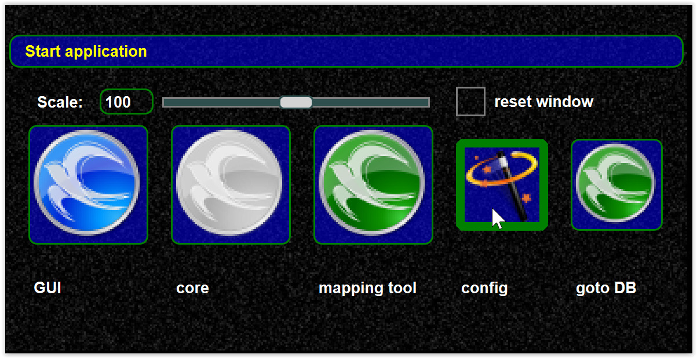

<!--
    SPDX-FileCopyrightText: Copyright (C) swift Project Community / Contributors
    SPDX-License-Identifier: GFDL-1.3-only
-->

You can start the configuration wizard from the launcher.
Normally the configuration wizard will be launched when the installer finishes.
The configuration wizard allows you to set default values for the most important setting values and download the DB data.

You can copy data from other swift versions via the launcher wizard.

