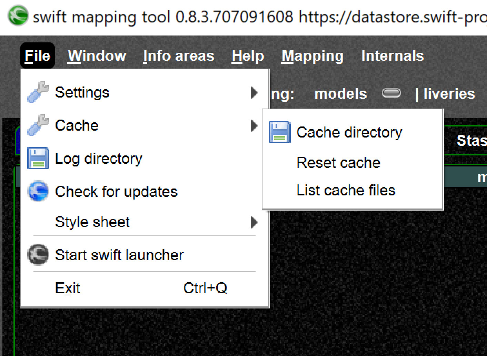

<!--
    SPDX-FileCopyrightText: Copyright (C) swift Project Community / Contributors
    SPDX-License-Identifier: GFDL-1.3-only
-->

You can find your swift user data in the application data directory, which depends on the OS you are using.
On Windows this directory will be `AppData/Local/org.swift-project`.
As you can install multiple swift versions on your system, you might see a directory for each of those installation.
Within such a directory you will find sub directories for log, cache, and settings data.

You can also access these directories from your swift applications' File menu.

{: style="width:50%"}

!!! tip

    In the [Launcher Wizard](./swift_launcher_wizard.md) you can transfer settings and cache data between different swift installations.
