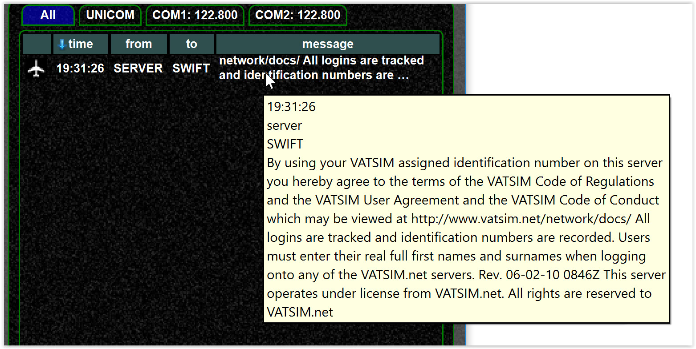

<!--
    SPDX-FileCopyrightText: Copyright (C) swift Project Community / Contributors
    SPDX-License-Identifier: GFDL-1.3-only
-->

## Detached message window

You can detach the `message window` (like any other window)

{: style="width:70%"}

## Overlay messages

From the ATC and cockpit view you can use overlay text messages directly in the window

{: style="width:50%"}

{: style="width:50%"}

## Private message buttons

You can use the `private message buttons` to send private messages to the closest ATC stations

{: style="width:50%"}

## Configure text messages

- Defining which text messages are relayed to the simulator

{: style="width:50%"}

- Defining which text messages are shown as overlay in the client

{: style="width:50%"}

- Set focus as wanted

## Disable overlay messages

Disable all checkboxes for overlay messages

{: style="width:50%"}

## Text message views

Normally you have text views for each radio channel and/or private text messages.
The UNICOM and COM1/2 channels are permanent while the private channels can be closed.

{: style="width:70%"}

That leads us to the role of the `ALL` view.
This is a sortable table view (and no HTML text view as the other ones).
It's role is different:
It can help you to find a message again if you have already closed the private message tab or you do not know where it was.

!!! tip

    You can use the tooltip to see longer messages .. image::
    {: style="width:70%"}

## Relay messages to simulator
see [this article](./settings/simulator_messages.md).
