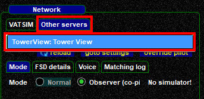

<!--
    SPDX-FileCopyrightText: Copyright (C) swift Project Community / Contributors
    SPDX-License-Identifier: GFDL-1.3-only
-->

[Euroscope](https://www.euroscope.hu/wp/) and [vSTARS](https://vstars.metacraft.com/) have internal FSD/proxy servers that *swift* can connect to and receive aircraft position data.
This data can be injected into your flight simulator and then be used as Tower View simulation.

!!! note

    Euroscope needs to be version 3.2 **Beta 34** (or newer) to make it work correctly, as older versions do not contain the updated FSD server code for "Velocity".

We have produced a video tutorial for this topic: [Setup and use swift for Tower View](https://youtu.be/5XjnELFZ0a4)

!!! danger

    Be careful to avoid opening an accidental second connection to VATSIM, as it is not allowed!
    Make sure that you really connect to the local proxy server of your ATC client!

Euroscope radar screen with vSMR plugin and traffic situation as seen in X-Plane 11

{: style="width:50%"}
{: style="width:70%"}

## Setup swiftGUI Tower View
* **start *swift*GUI**
* select ``Connect``
* in ``Network`` select ``Other Servers`` tab
* click on ``goto settings``
  * **create a server** for ``localhost`` by filling in a suitable name (e.g. "Tower View") and a description (e.g. "Local Tower View")
  * **address** => ``localhost`` or ``LAN IP-address`` of the computer that is running your ATC client
  * **port** => 6809
  * set **Eco.** to ``VATSIM`` and **type** to ``FSD [VATSIM]``
  * fill in random characters/numbers in the fields for **real name**, **ID** and **password** (none of them are used for a proxy connection, but the fields **must not be empty**)
  * **save your settings!**

  {: style="width:70%"}

## Connect to ATC Client
* **run Euroscope** or **vSTARS**, centered at the airport of your choice
  * **Euroscope**: it is **not** necessary to start its Proxy Server
  * **vSTARS**: start its internal Proxy Server with the dot-command ''.startproxy''
- **connect** Euroscope / vSTARS to VATSIM
- **start** X-Plane 11 or P3D at the airport that your ATC client is centered on
    * **X-Plane 11**: use any aircraft (e.g. C172) on a remote stand. Once started, select Tower (shift+5) or Free Camera (key "c")
    * **P3D**: select **Tower Controller** from the main startup page/Location/Starting Location (bottom of list)
- do **NOT** start swiftGUI as usual, but **Disable Audio (AFV)** first.
  For this, start ***swift*Launcher** and set a checkmark to disable Audio for VATSIM (AFV).
  Then make sure that you **start** *swift*GUI through the icon in *swift*Launcher.
  Otherwise *swift*GUI will continuously try to connect the AFV-server and produce error messages!
  {: style="width:70%"}
- in ***swift*GUI**, select the **Connect widget**.
  In **Network** options, there select the **Other Servers** tab and then the Tower Server that you just created
  {: style="width:70%"}
- the information in the **Own aircraft** section is irrelevant, you can fill in anything or leave it as it was before
- **click on ``Connect``**
