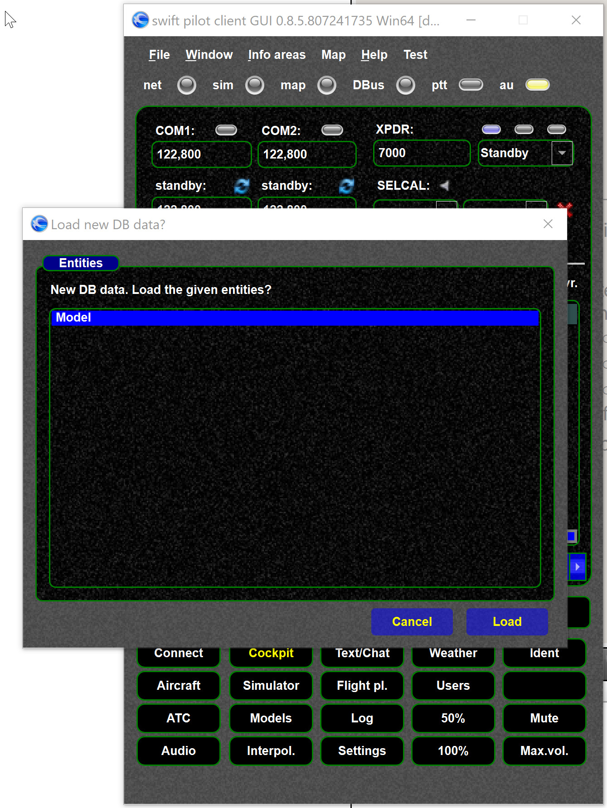
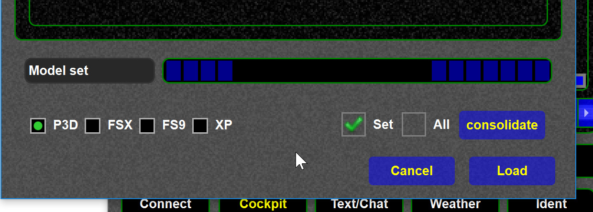

<!--
    SPDX-FileCopyrightText: Copyright (C) swift Project Community / Contributors
    SPDX-License-Identifier: GFDL-1.3-only
-->

When new model data (more precisely "shared data", a copy of the DB data) are published, you will see an update screen in the pilot client.
Those data include airline data, model data, new liveries etc.
New data will be published if new mappings are created, data are corrected, new airlines are added.
**It will NOT update the program, only data**.

This update will do two things.

- download the latest model data (ICAO codes, models, liveries ...)
- consolidate the data, see [this article](./../swift_data/why_consolidation.md).
  This means your model set data are updated.

!!! note

    This step can take a while to complete as all the data will be downloaded and merged (consolidated) with your simulator models.
    Normally you can just run the update without doing anything.

{: style="width:50%"}

{: style="width:50%"}

!!! note

    When you run the mapping tool the latest DB data will be automatically downloaded, so in that case you already have the latest data.
