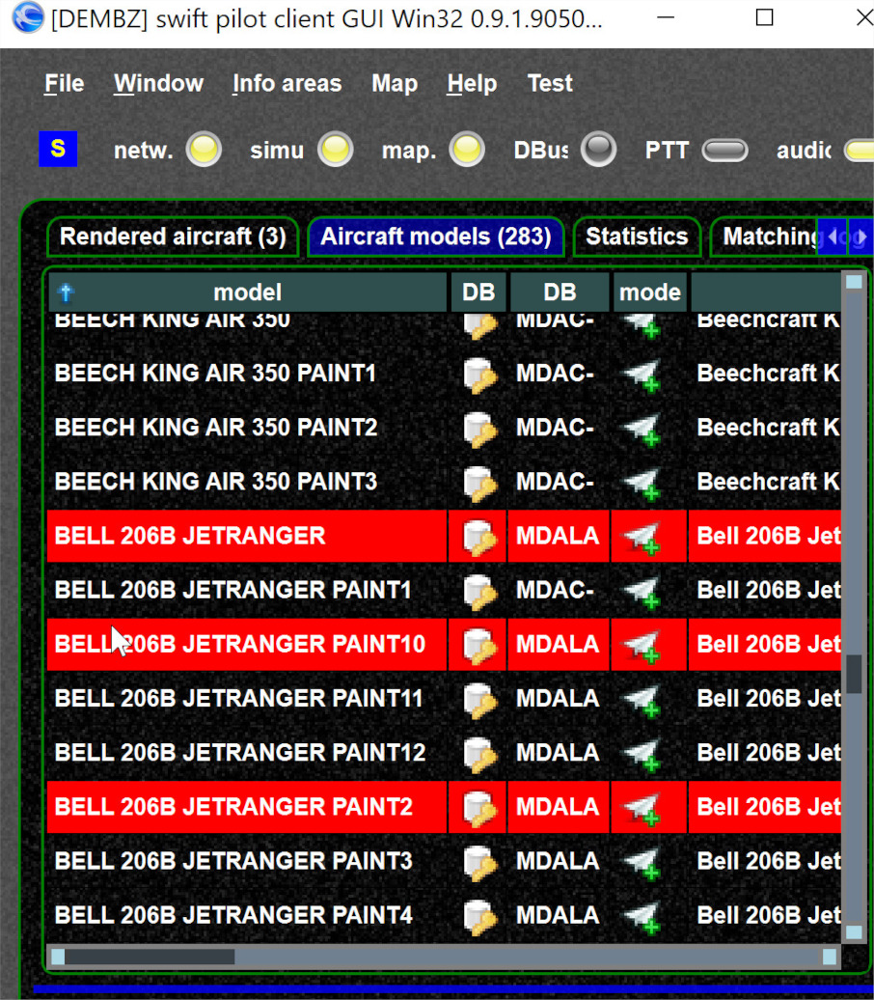
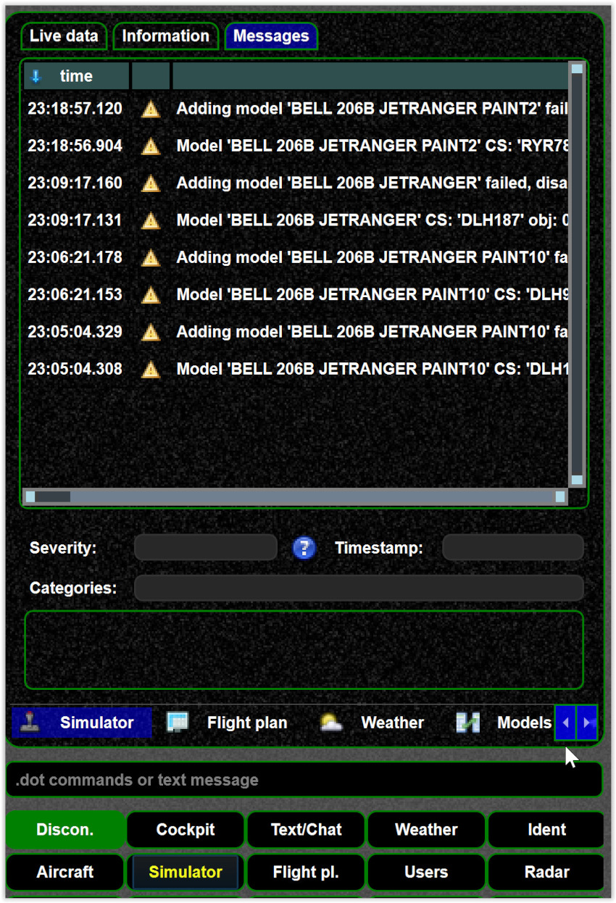

<!--
    SPDX-FileCopyrightText: Copyright (C) swift Project Community / Contributors
    SPDX-License-Identifier: GFDL-1.3-only
-->

## Model validation

We recommend to run model validation if a model fails, see [this](./model_set_validation.md) and [this](./model_set_validation_example.md) article.
However, sometimes models fail even though there is no validation error.

## Disabled models in client

If a model fails to be added to the simulator it will be marked in red.

{: style="width:50%"}

Normally you will see a corresponding message in the simulator messages

{: style="width:50%"}
