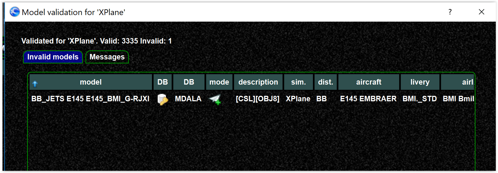

<!--
    SPDX-FileCopyrightText: Copyright (C) swift Project Community / Contributors
    SPDX-License-Identifier: GFDL-1.3-only
-->

If validation errors are shown during your pilot client startup, this means swift detects that something is wrong with your model set.
See also [this](./model_set_validation.md) and [this](./model_set_validation_example.md) article.

## Single validation errors (a few models only)

This means a single model is "broken", maybe malfunctioning: There is no general advice, this needs to be investigated case by case.
A simple solution would be to remove the model from the model set.

{: style="width:80%"}

You do **NOT** have to uninstall the model, removing from the model set is enough (remove and SAVE).

## Multiple validation errors

Multiple validation errors mean something is generally wrong.
Most likely the file path for the model is not correct.
That can mean:

-   you have moved your model directory and not updated your model set,
    [solution](./../../troubleshooting/models/create_recreate_model_set.md)
-   Is your XPlane model directory within the XPlane directory?
-   For XPlane it might me that you made a mistake during the
    installation of the vertical offsets and ended up with cascaded
    directories.
    Fix the offsets, then [re-create your model set](./../../troubleshooting/models/create_recreate_model_set.md)
-   For FSX/P3D: It can be that there is a mismatch with the
    `Simobjects.cfg`, `Add-ons.cfg` and `Add-On-xml` files

!!! tip

    Check the validation messages, not only the `INVALID MODELS` - there might be further information.
