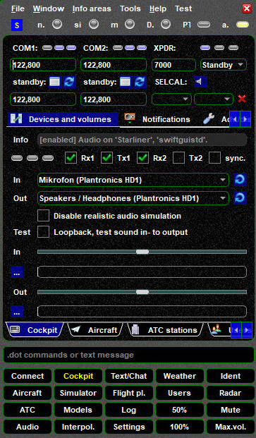

<!--
    SPDX-FileCopyrightText: Copyright (C) swift Project Community / Contributors
    SPDX-License-Identifier: GFDL-1.3-only
-->

# Documentation

*swift* consists of several components, see the short overview below.

## swiftGUI
*swift*GUI is the User Interface for your **day-to-day use** while flying online.
It will connect you to VATSIM or to private FSD-servers, you can file flightplans, check for active ATC in your area, list other pilots in the vicinity, help you with a radar function and many more things.
Go to the **[swiftGUI user guide](./swift_gui/index.md)** and take a **program tour** with our [Video Tutorials](./../home/video_tutorials.md).

{: style="width:49%"}
{: style="width:49%"}

{: style="width:49%"}
{: style="width:49%"}

{: style="width:49%"}
{: style="width:49%"}

## swiftData - The Mapping Tool
*swift*Data is our Mapping Tool.
It's a powerful program to manage your aircraft model sets in *swift*.
Although it may look very complicated, it actually is not and with the help of our **[Video Tutorials](./../home/video_tutorials.md)** you will master it easily.

{: style="width:80%"}

## swiftLauncher
*swift*Launcher is your gateway to all components of **swift**.
Program updates, database downloads, modes of operation, start all other components of *swift* - that's what can be done here.
Go to the **[swiftLauncher user guide](./swift_launcher.md)**

{: style="width:50%"}

## swift Datastore
**[swift Datastore](./swift_datastore/index.md)** is our central database and contains information about airlines, aircraft, liveries and aircraft model mappings and is essential for data updates distribution.
Go to the **[swift Datastore](./swift_datastore/index.md)**

{: style="width:80%"}
