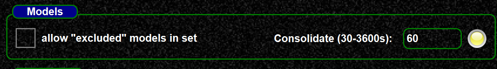

<!--
    SPDX-FileCopyrightText: Copyright (C) swift Project Community / Contributors
    SPDX-License-Identifier: GFDL-1.3-only
-->

The background updater allows to automatically reload and consolidate data in the mapping tool.
This helps when other users also create new mappings and you want to keep your data synchronized with the latest changes.

Enable the updater in the settings by entering an update period.
You should see a green LED then.

The updater will automatically reload and consolidate, so it is automatically performing the 2 steps shown below:

{: style="width:70%"}

{: style="width:70%"}
