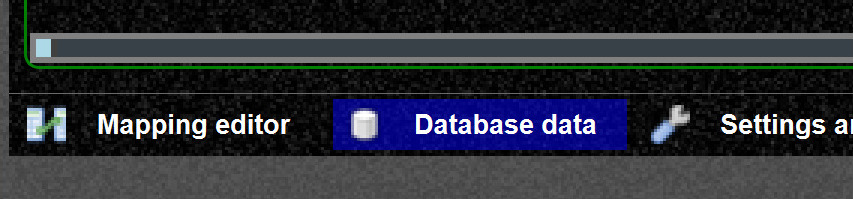
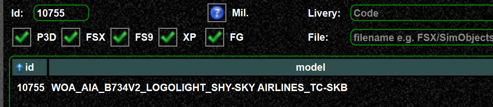
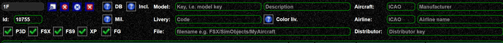
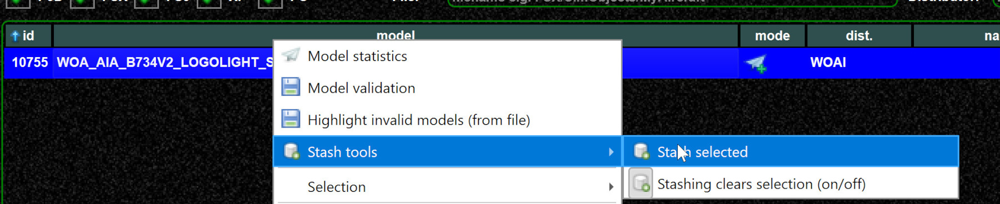
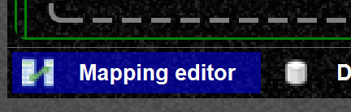
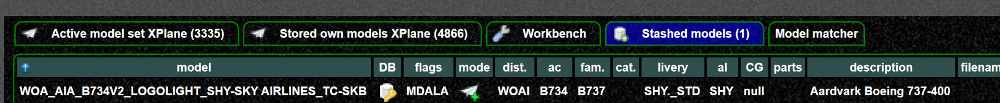
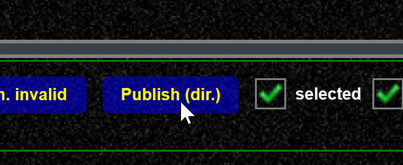

<!--
    SPDX-FileCopyrightText: Copyright (C) swift Project Community / Contributors
    SPDX-License-Identifier: GFDL-1.3-only
-->

Let's say you want to fix/change a particular mapping.

-   locate this mapping in the mapping DB data

{: style="width:50%"}

-   here I find it by its id, but this is is just an example

{: style="width:50%"}

-   you could also find it by other filter criteria

-   then you mark this model and stash it, `ALT + s` also works

{: style="width:75%"}

-   changing a model requires to login
-   now it can be changed in the mapping editor under stashed models

{: style="width:50%"}

-   and the published

{: style="width:50%"}

Aircraft ICAO codes can be requested here: <https://datastore.swift-project.org/>
