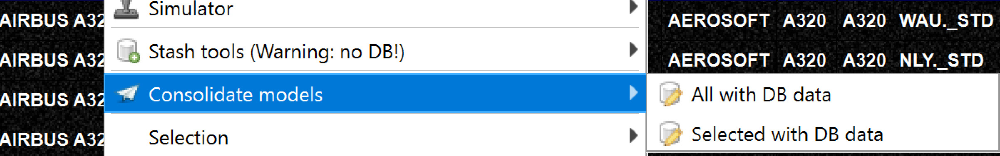
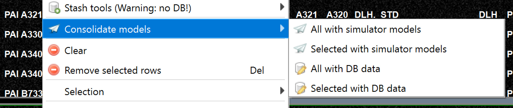

<!--
    SPDX-FileCopyrightText: Copyright (C) swift Project Community / Contributors
    SPDX-License-Identifier: GFDL-1.3-only
-->

You will find the consolidation context menu on the model set and own models tab.

See the screenshots below.

-   See also [this article](./why_consolidation.md).
-   Consolidation with DB data means, that the latest DB data on your disk (you can use the launcher to update those files) will be used and merged with your model or model set data.
    This is useful whenever new DB data are available.

    !!! note

        When you start the mapping tool the latest DB data will always be downloaded

    - Another way to obtain the DB data is with the launcher, see [launcher](./../swift_launcher.md)
    - You can keep your mapping tool data up to date while working with the [background updater](./background_updater.md).

- Consolidation with "own models" data means that the latest data from your own models installed will be merged with the data in the model set.
  This is required only when the model data on your disk change.

{: style="width:80%"}

{: style="width:80%"}
