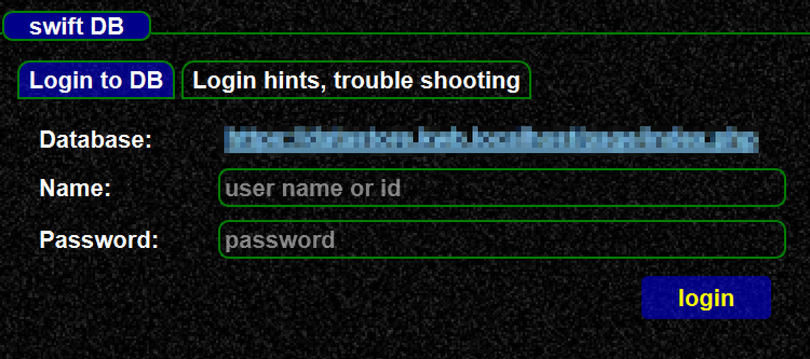
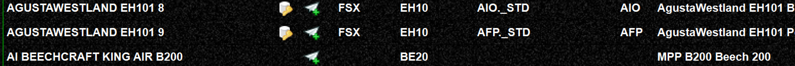
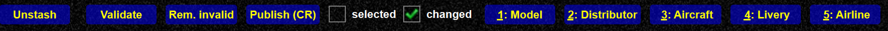
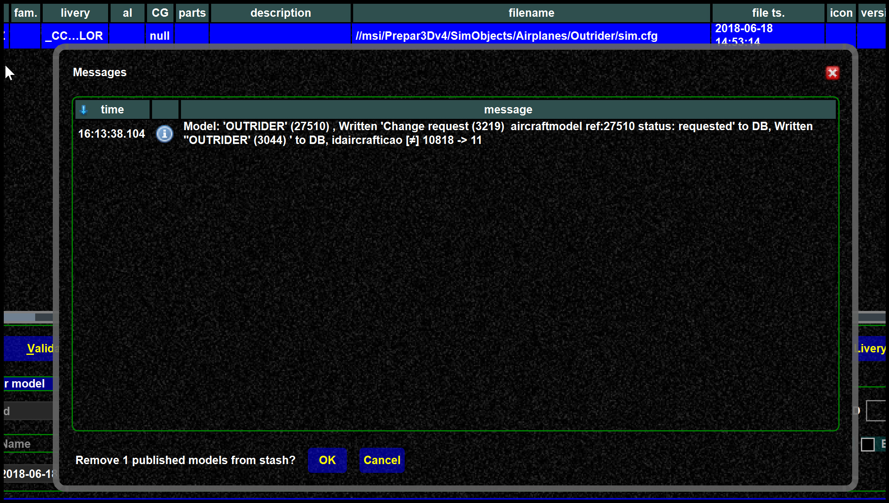
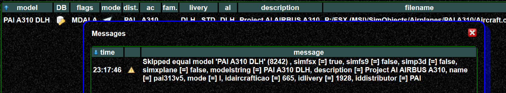

<!--
    SPDX-FileCopyrightText: Copyright (C) swift Project Community / Contributors
    SPDX-License-Identifier: GFDL-1.3-only
-->

!!! danger

    We recommend to save your stash after you have create the mappings.
    If something goes wrong you can reload your work and publish it again.

## Login

In order to create mappings you need to login within the swift datastore:
In the mapping tool, go to the "Settings and Login" tab, and login with the DB.
After the login you can see your roles as explained in [this article](./../../troubleshooting/model_mapping/mapping_db_roles.md).

{: style="width:80%"}

## Models with/without mapping

Models which already have a database mapping are indicated by a database icon.
You can see that in the screenshot.
Normally you need to create mappings only if it not yet exists.

It can also happen, that your data are outdated and in the meantime someone has created a mapping for model, which is not yet shown with the database icon.
You can read more about [data consolidation here](./consolidation.md).

Another good reason to change an existing mapping is if it is wrong.
In this case you can correct the mapping.
The procedure (for you) is the same, regardless if you create a new mapping or modify an existing one.

{: style="width:90%"}

## Direct mappings / Change requests

Users with "bulk" update right and higher (see [this article](./../../troubleshooting/model_mapping/mapping_db_roles.md)) can directly write to the DB.
Other users will be able to create change requests.
For you as a user there is almost no difference in creating the mapping, only the release process is different.

- Normal users: publish change request confirmed in DB

{: style="width:90%"}

-   Direct updates:

{: style="width:90%"}

-   new mappings: publish in DB
-   changed mappings: publish change request confirmed in DB

## Mapping confirmation

After you have successfully published your mappings you will see a "confirmation screen".
You can remove those published models (if you like) from the stash.
Doing so allows you to publish step by step.

{: style="width:90%"}

## Equal mappings

It does not make sense to publish mappings identical to an existing one in the DB.
This would only create unnecessary change requests and work history entries.
Therefor publishing identical entries is rejected.
You will see a message like this in such a case:

{: style="width:90%"}

## Problems?

see [this article](./problems.md).
