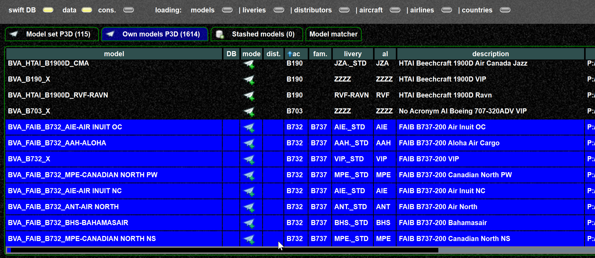
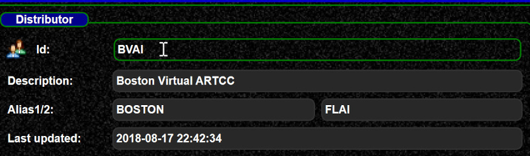
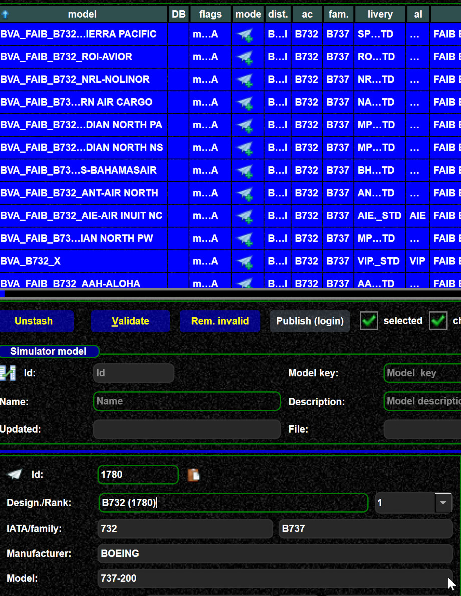
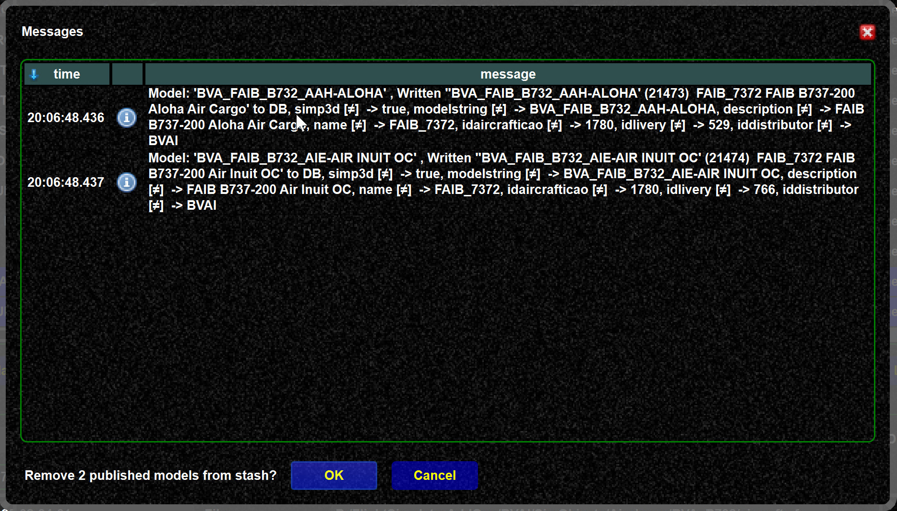
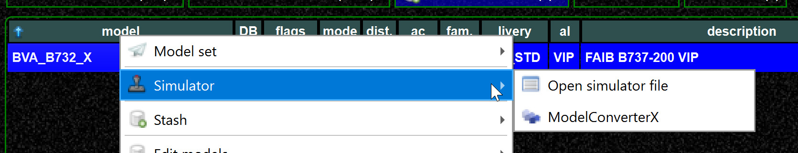
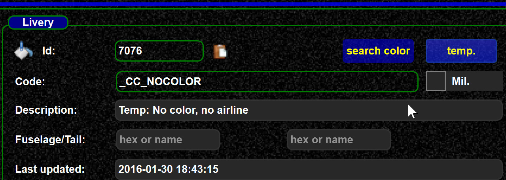
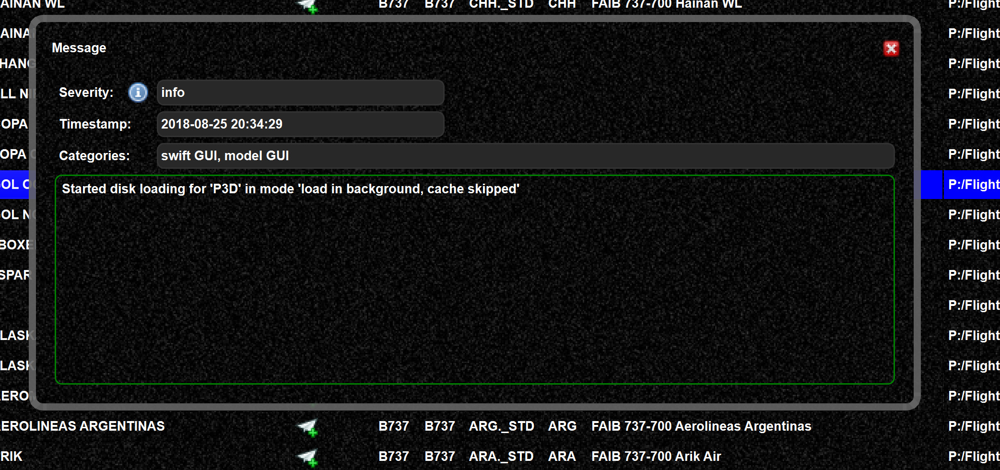

<!--
    SPDX-FileCopyrightText: Copyright (C) swift Project Community / Contributors
    SPDX-License-Identifier: GFDL-1.3-only
-->

First of all, swift mapping is about quality, not quantity.
So just create a mapping which is wrong is not the goal.
However, there are some tricks to speed up the mapping process.

## Use pre-selected models

The process becomes much faster if you but models on the stash which have something in common.
That can be the "distributor", the "ICAO code" or even multiple attributes.

Example:

-   Here I select all ``B732`` of the ``BVAI`` distribution.
    So I already know I will have only those models on the stash.
    Stash those

{: style="width:90%"}

-   Now on the stash, I select all of the, and assign ``BVAI``
    by pressing ``distributor`` to all selected. So by one
    click, the distributor is set for all models.

{: style="width:90%"}

-   Same for the aircraft ICAO, select ``B732``, ``aircraft ICAO``, and all models have the correct ICAO code

{: style="width:90%"}

-   With these 2 simple steps, you have fixed distributor and aircraft ICAO, now only the livery/airline is missing
-   Now we check the airlines one by one, remember it is about quality.
    A good share will already be correct.
-   Whenever I have found some correct ones, I select and publish them (small steps)

{: style="width:90%"}

-   Then I remove them from the stash, so I have only those left which I still need to handle
-   After a few iterations I have one model left I still need to resolve.
    In my case ``ModelConverterX`` could be used to check the model (what it really is)

{: style="width:90%"}

-   If you are unable to resolve the livery, you can provide at ``temp livery``.
    This is a special livery for those aircraft still need a correct livery assigned.
    In such a case "specialists" can select those models and add the missing information.

{: style="width:90%"}

**Summary:** This examples shows how you can quickly write mappings for a larger number of aircraft.
You do not need to follow each step, it is to give you an idea about mapping techniques.

## Using models of a arbitrary directory

Maybe you want to download models and do the mappings **without** installing them for your flight simulator.
In that case you can use a little trick and use `force reload from directory`

{: style="width:90%"}

So when I install the ``BVAI`` models (for example) in `C:\temp\BVAI` I can load my own models from there.
Then you can create the mapping for those models without installing them into you flight simulator directories.

{: style="width:90%"}

Unfortunately you have to reload you simulator models again, if you want to have those from the simulator back.
But could also save the models to a file (like for a backup), and later load them again.
