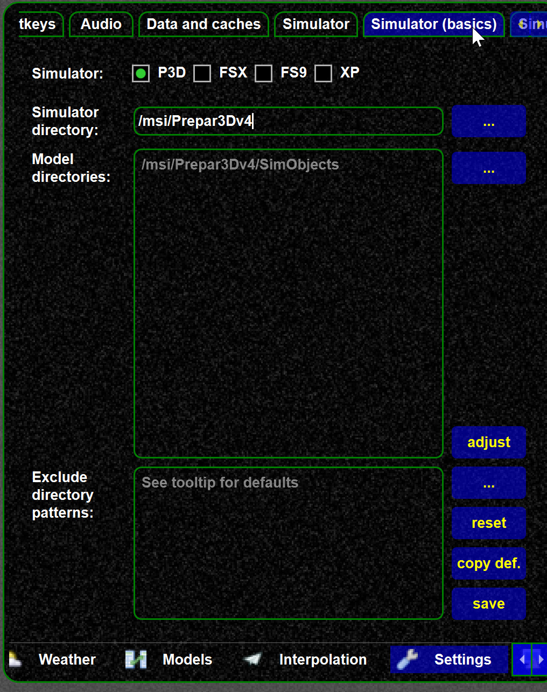
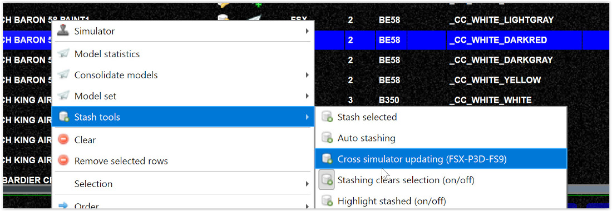

<!--
    SPDX-FileCopyrightText: Copyright (C) swift Project Community / Contributors
    SPDX-License-Identifier: GFDL-1.3-only
-->

## P3D: Using aircraft folders outside the simObjects

If you need to configure multiple aircraft folders you can do that on the simulator mappings.

-   the settings can be changed
    -   in the wizard,
    -   the pilot client, or
    -   the mapping tool

-   You can configure multiple model directories

-   default values are shown in gray, if you explicitly set directories those are shown in white

{: style="width:50%"}

## Updating the supported simulators (cross simulator updates)

Many models work with FSX, FS9, and P3D.
It is useful if this information is properly kept, so the wizards and tool work best.

You can use the cross simulator tool (FSX, P3D, FS9) to check your local models, find out which simulator they belong to, and then update the flags.

{: style="width:90%"}

After the run you will see automatically stashed models you can use to update the database models for the changed flags.
