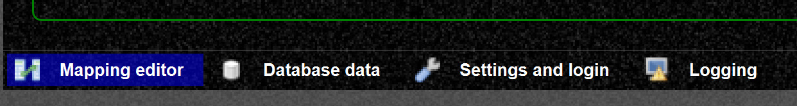
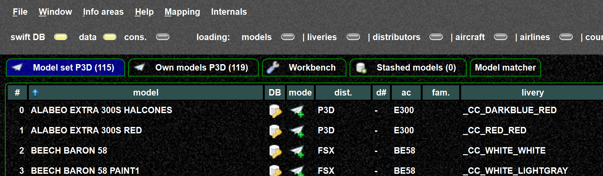
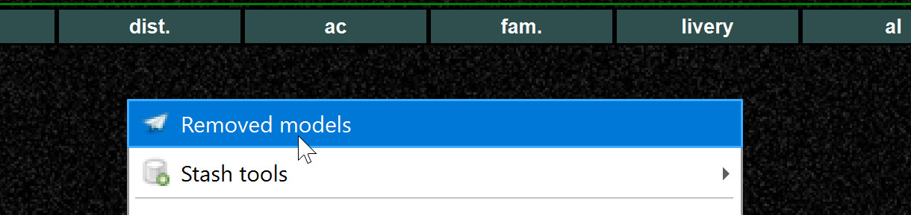
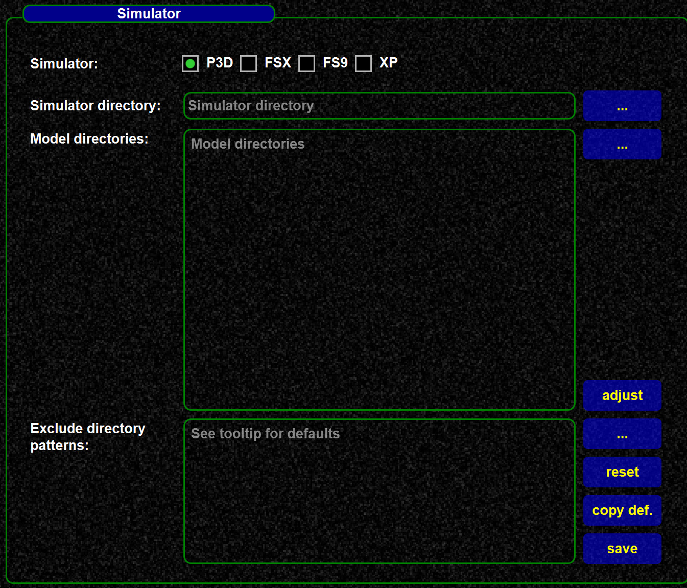
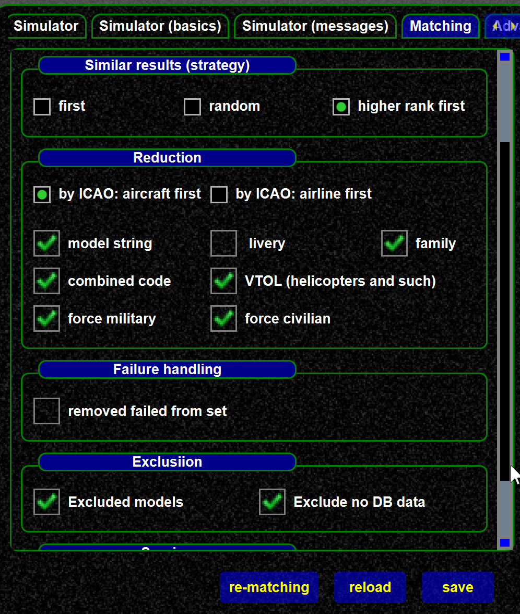

<!--
    SPDX-FileCopyrightText: Copyright (C) swift Project Community / Contributors
    SPDX-License-Identifier: GFDL-1.3-only
-->

{: style="width:50%"}

Mapping tool tabs:

1.  Mapping editor, see below
2.  Database data, all data from the mapping database data
3.  Settings and login, credentials and setup of mapping tool
4.  Logging, log. messages

## 1 - Mapping editor tabs

{: style="width:70%"}

-   "Model set", here you define your model set, those are the models used for model matching.
-   "Own models", these are the models available for your simulator.
    The models here correspond with the settings "model directories" (see below)
-   "Workbench", here you can load temporary data and use them for further actions.
    This tab allow to load data without affecting your data of "own models", "own model set".
    -   Example: An other user can save some models from "his model set/his models", you can load and stash them from here.
    -   **Removed models:** *swift* pilot client allows to save models which cannot be rendered (this corresponds with "remove from set", see below).
        This allows to later investigate them and remove them from the model set, if required.
        If such "removal lists" are saved, you will see them in the directory browser.

        {: style="width:75%"}

-   "Stashed models", here you modify and prepare mappings for the database, and eventually upload them to the database.

-   "Model matcher" allows you to test you model set, so you can provide various data as they would be received from the FSD protocol and test what model would be selected.

### Mapping tab related functions and settings

Those settings decide which models you use and how the models are used with matching.

-   Model directory settings:

{: style="width:50%"}

-   Matching settings:

{: style="width:50%"}

## 2 - Database tab

Displays all database data, and allows to reload DB data.
See [this article](./reload_db_data.md).
