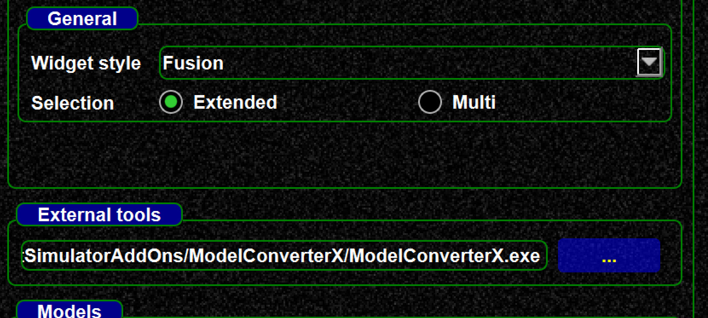
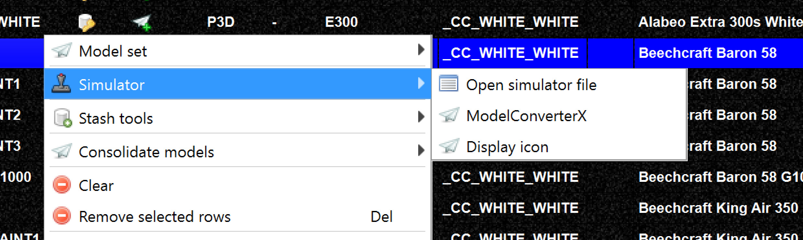

<!--
    SPDX-FileCopyrightText: Copyright (C) swift Project Community / Contributors
    SPDX-License-Identifier: GFDL-1.3-only
-->

You can view models directly with MCX.
MCX is an external tool, see <http://www.fsdeveloper.com/wiki/index.php?title=ModelConverterX>.
It is **not** part of swift and you have to install it on your own.
We will not be able to provide support for the tool!

!!! warning

    Sometimes liveries will not be shown correctly (no idea why)

In order to enable MCX set its binary (i.e. exe) in the settings, then you can call it from the context menu.
We have tested with the latest dev. version of MCX.

{: style="width:70%"}

{: style="width:70%"}
