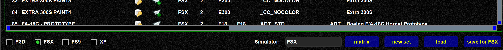

<!--
    SPDX-FileCopyrightText: Copyright (C) swift Project Community / Contributors
    SPDX-License-Identifier: GFDL-1.3-only
-->

You can keep and save multiple model sets.
The idea is that you can create specialized model sets for events, or just tryout a new set.

The model set can be saved from the context menu.

{: style="width:70%"}

The model set can be loaded from the context menu or the "load button" beneath the model set view

