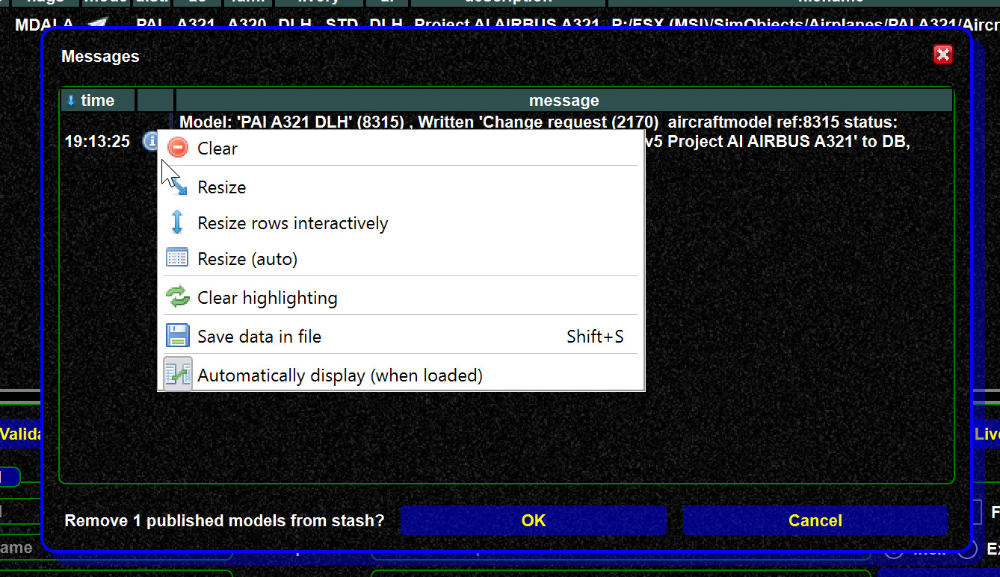

<!--
    SPDX-FileCopyrightText: Copyright (C) swift Project Community / Contributors
    SPDX-License-Identifier: GFDL-1.3-only
-->

## Mapping overlay messages

-   Use the context menu in the mappings overlay message window to resize the messages if you cannot read them
-   You can save the messages (context menu since 0.8.3) and attach the save messages to a bug report if needed

{: style="width:70%"}

## Models are already in DB, but not shown as such

There are 3 model views:

* Own model (you models installed/on disk)
* Own model set, a subset of of your own models
* The database view

There are 2 potential problems:

* A user has created/updated a model very recently, and you have not a local copy yet.
  So this new model is not yet shown in the database view.
  This issue will be resolved after a data consolidation, a restart of the mapping tool, or when you update the database view.
* A model is shown in the DB tool, but not in own model set/own models.
  Check out [Background updater](./background_updater.md) and [Consolidation](./consolidation.md).
