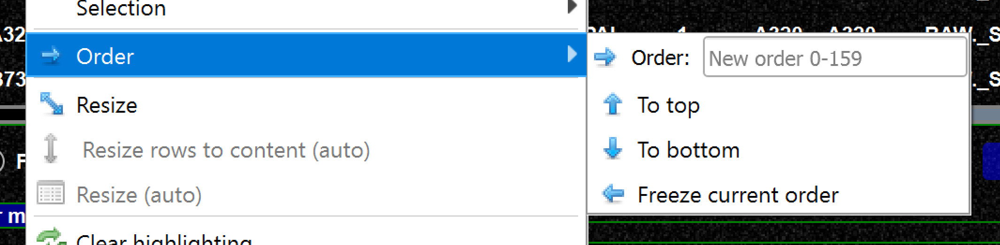
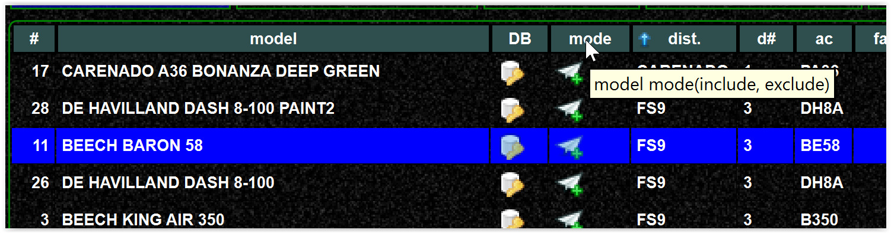

<!--
    SPDX-FileCopyrightText: Copyright (C) swift Project Community / Contributors
    SPDX-License-Identifier: GFDL-1.3-only
-->

## Sorting (ranking) a model set

Depending on the settings, it can be configured **if two models have the same matching score, which one is taken**.

Just a few hints at the very beginning

-   **Sorting order of the model set only applies if two models are calculated "as equal" by the algorithm**.
    It depends on the settings how the calculation is done.
-   In general you should ask yourself why you have the same models multiple times in your set, e.g. why did you add 2 ``B747`` of ``DLH``, so what do you try to achieve by that? See [Remove duplicates](./../../troubleshooting/models/removing_duplicates.md).

## Remove duplicates

If you have no duplicates there is no real need for ranking.
Ranking is needed if more than one model have the same score, but if you have only one aircraft/livery combination it is not very likely that this happens.

## Manually ranking
-   You can manually apply a rank by the context menu

{: style="width:50%"}

-   The rank is displayed in the first column

{: style="width:50%"}

-   If you sort by another column it does mean the ranking has changed

{: style="width:50%"}

-   However, if you like a certain sort order to become your current ranking, just use "freeze order".
    After you will see that the rank column will change order accordingly

## Make filtered data my model set

-   If you filter a model set, this is a temporary action and the model set will not be changed
-   If you want to keep the filtered data as your new model set, just use "materialize" from the context menu

{: style="width:50%"}

## Rank by distribution order

In order to create a sorted order by distributor you can apply a distributor ranking

-   First you need to create preferences by distributor in the settings of the mapping tool

{: style="width:50%"}

-   Then you can apply these preferences

{: style="width:50%"}

-   Now you have a sort column for distributors and you can use to "sort by distributors"

{: style="width:50%"}

-   Once you are happy with your sorting, you can use "freeze order"

!!! danger

    In order to use the rank you need to enable the setting!

    {: style="width:50%"}
