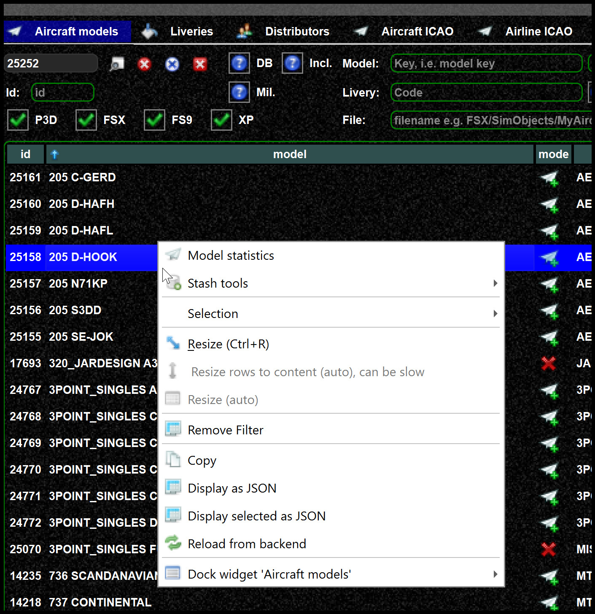
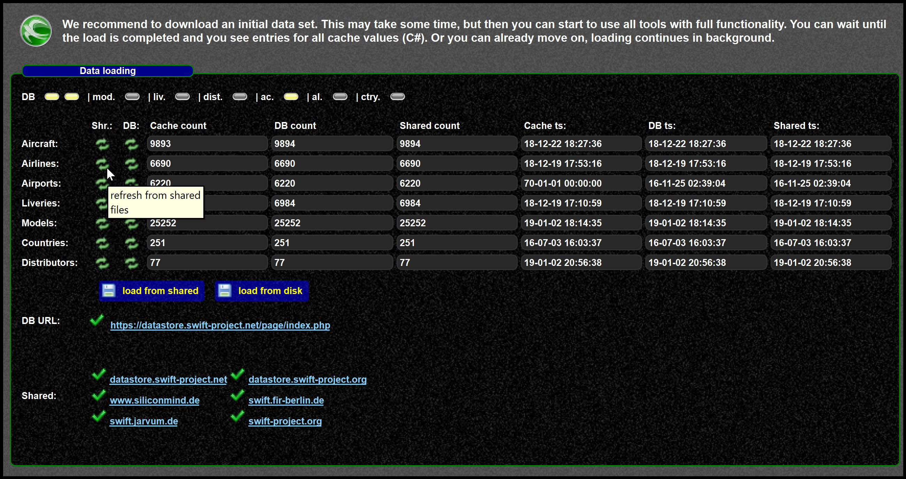

<!--
    SPDX-FileCopyrightText: Copyright (C) swift Project Community / Contributors
    SPDX-License-Identifier: GFDL-1.3-only
-->

You can reload the latest DB data with the context menu of the database tabs.

{: style="width:60%"}

You can also refresh the DB data from the configuration wizard or pilot client

