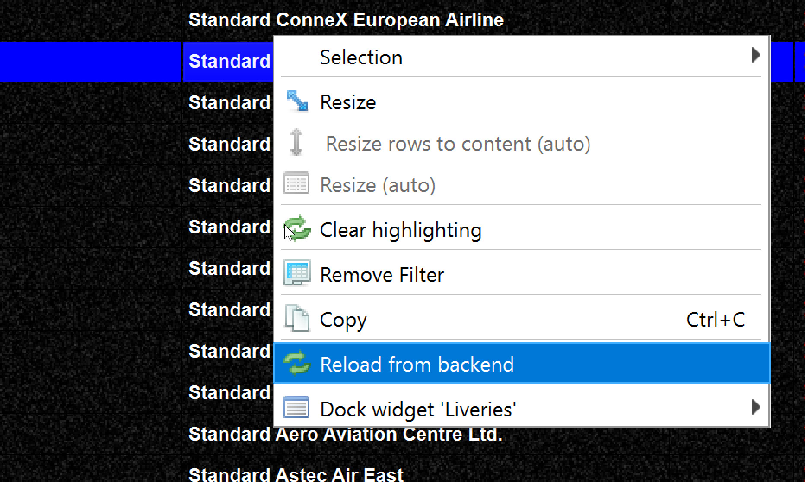
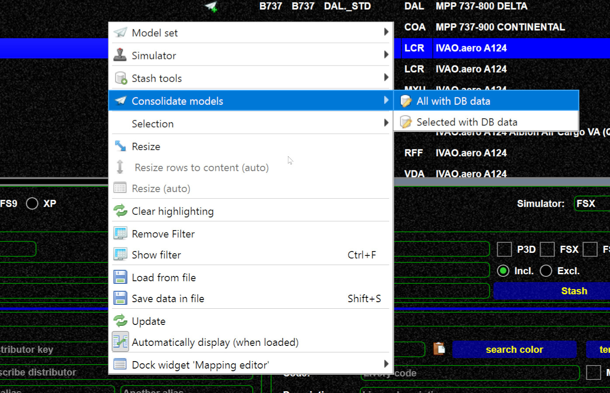

<!--
    SPDX-FileCopyrightText: Copyright (C) swift Project Community / Contributors
    SPDX-License-Identifier: GFDL-1.3-only
-->

If you have created mappings you might wonder how you can see them:

!!! note

    Normal users creating change request have to wait before we accept the changes.
    Before that the are still invisible for you.

New DB data can always be downloaded via context menu (right mouse)

{: style="width:50%"}

If you want to update your models or model set, try "Consolidate".
This will go to the DB, check for new/changed data and update your entries.

{: style="width:70%"}
