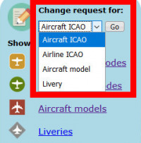
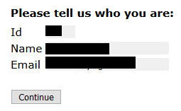
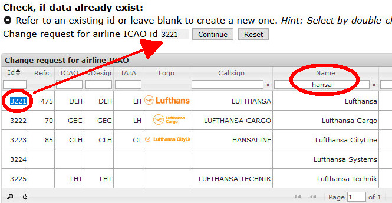
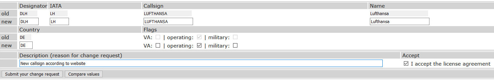
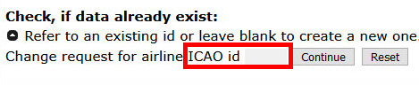

<!--
    SPDX-FileCopyrightText: Copyright (C) swift Project Community / Contributors
    SPDX-License-Identifier: GFDL-1.3-only
-->

We do our best to keep the database up to date, but if you spot outdated information or mistakes, you can make CRs (change requests) at *swift* Datastore.
Our Datastore administrators regularly check for new CRs and will either approve, correct or reject them.
In other words: your requested changes will not take immediate effect, they need to be reviewed and approved first.

## Research and Verify

!!! note

    **Please** make sensible requests only, **research and verify** the data **before** you make a Change Request in *swift* Datastore!

**Useful databases to research and verify:**

* **Airline data** from Wikipedia: [IATA - ICAO - radio telephony callsign - name](https://en.wikipedia.org/wiki/List_of_airline_codes)
* **Aircraft type codes**: [Official ICAO database](https://www.icao.int/publications/DOC8643/Pages/Search.aspx)
  * [more background](./icao_aircraft_hints.md) information on why some aircraft types seem to be missing from swift Datastore

## Making a Change Request

* proceed to [swift Datastore](https://datastore.swift-project.org/page/)
* From the drop-down menu, **select the type of change request** you want to make and click on **``Go``**:
  * Aircraft ICAO (aircraft type data)
  * Airline ICAO (airline data)
  * Aircraft model (CSL/AI model database of swift)
  * Livery (airline livery definitions)

  {: style="width:35%"}

* it will take you to a login-page. [See here for more information on how to create an account.](./../../documentation/swift_datastore/login.md)

* now just confirm your identity and **``Continue``**

  {: style="width:50%"}

* you will now see a list with database rows and columns.
  You can either request changes to existing entries or create new DB-entries.
  **Please, before you do any of this**, **search the datbase** for potentially existing entries first - we don't want duplicate entries!

## Change Request for Existing Data
Example: you want to change **Airline ICAO data** for "Lufthansa"

- **search the list** for "hansa"
- choose the row with the airline that you want to change and **double-click on the ID** (first column) to transfer it to the grey field on top
  - click on **``Continue``**

    {: style="width:80%"}

  - you will now see a **data form**
    * add or modify data in the rows that are titled **``new``**
    * make your changes to the data
    * add information about the reason for changes (if possible with a reference/source/website)
    * accept the license agreement and then **``Submit your change request``**

    

## Creating a New Entry

Example: you want to add a new airline to **Airline ICAO data**

- **search the list** for the airline you want to add. Make sure it does not exist under a slightly different name or code
- if there's no result in our airline database, check that the grey box above the table is empty. If it is not, click on **``Reset``**
- click on **``Continue``**

{: style="width:70%"}

- you will now see an empty **data form**
  * you can add data in the rows that are titled **``new``**
  * if you are adding a **virtual airline**, set a check-mark next to **``VA``**
  * only if the airline is still active in the real world, set a check-mark next to **``operating``**.
    If it is defunct, do not set a check-mark
  * add information about the reason for the entry (if possible with a reference/source/website)
  * accept the license agreement and then **``Submit your change request``**
  {: style="width:80%"}
