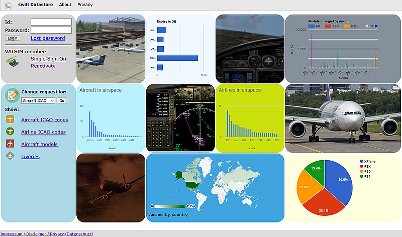

<!--
    SPDX-FileCopyrightText: Copyright (C) swift Project Community / Contributors
    SPDX-License-Identifier: GFDL-1.3-only
-->

# swift Datastore

The *swift* **Datastore** is our central database.
Essentially it contains all ICAO data for airlines and aircraft types, liveries, aircraft&model distributors, model data, aircraft mapping information, admin-functions to work with user change requests and more.

You can reach it with [this link](https://datastore.swift-project.org/page/).

## Register in swift Datastore
To submit **Change Requests(CR)** for aircraft model mappings and for database entries of airlines/aircraft-types/liveries, logging in to the Datastore is required.
[More information about registering with swift Datastore](./login.md).

## Mapping and ICAO database change requests

* CSL, AI and aircraft mapping: [quick mapping in swiftGUI](./../flying/instant_mapping.md) and [normal mapping in swiftData - the Mapping Tool](./../swift_data/create_mapping.md)
* [Change Requests(CR) for Airline Data and Liveries](./change_requests.md)
* [Virtual Airlines](./virtual_airlines.md)
